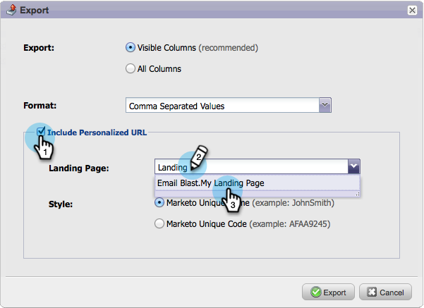

# 개인화된 URL이 {#export-a-list-with-personalized-urls}인 목록 내보내기

>[!PREREQUISITES]
>
>* [계정에 대해 개인화된 URL 활성화](enable-personalized-urls-for-your-account.md)
>* [랜딩 페이지에 대해 개인화된 URL 활성화](enable-personalized-urls-for-a-landing-page.md)

>

1. 목록 또는 스마트 목록을 선택하고 **리드** 탭을 클릭하여 결과를 가져온 다음 excel 아이콘을 클릭합니다. INLINE MarketingTo 고유 코드 ** 및 **Marketing To 고유 이름** [열이 표시](../../../../product-docs/core-marketo-concepts/smart-lists-and-static-lists/using-smart-lists/create-and-change-views-for-lists-and-smart-list.md)되었는지 확인합니다.

   

1. **개인화된 URL 포함**&#x200B;을 선택하고 PURL을 생성할 랜딩 페이지를 찾아 선택합니다.

   

1. **URL**&#x200B;을 선택합니다.

   

   >[!TIP]
   >
   >동일한 랜딩 페이지에 대한 여러 URL이 표시되는 경우 이전에 페이지 URL을 변경했고 리디렉션을 만들었기 때문일 수 있습니다.

1. **스타일**&#x200B;을 선택하고 **내보내기**&#x200B;를 클릭합니다.

   

1. 내보내기가 완료되면 **지금 다운로드** 링크를 클릭하여 파일을 저장합니다.

   

   이제 넌 끝났어! 이제 리드 목록과 개인화된 URL이 있습니다.

   

   >[!NOTE]
   >
   >이름과 성이 같은 리드가 있는 경우 번호가 자동으로 추가되어 URL이 고유하게 유지됩니다.

