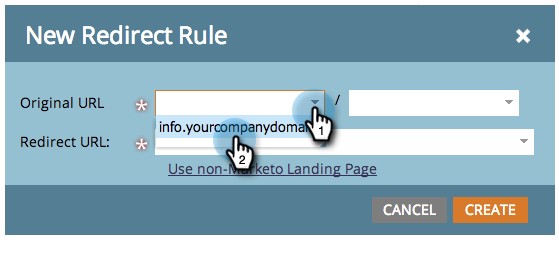

# URL 경로 리디렉션 {#redirect-a-url-path}

Marketing을 사용하면 URL 경로를 선택한 페이지로 쉽게 리디렉션할 수 있습니다. 방법

>[!NOTE]
>
>**관리자 권한 필요**

1. 관리에서 **랜딩 페이지** 를 **클릭합니다**.

   

1. 규칙 **탭을** 클릭한 다음 **신규 **및 **새 리디렉션 규칙을 클릭합니다**.

   

1. 첫 번째 **원본 URL** 드롭다운을 클릭하고 Marketing CNAME을 선택합니다.

   

   >[!NOTE]
   >
   >**미리 알림**
   >
   >
   >Marketing CNAME으로 시작하는 URL만 리디렉션할 수 [있습니다](../../../../product-docs/demand-generation/landing-pages/landing-page-actions/customize-your-landing-page-urls-with-a-cname.md).

1. 오른쪽의 두 번째 **원본 URL** 필드에 리디렉션할 URL 경로(또는 특정 페이지)를 입력합니다.

   

1. 비마케팅 **랜딩 페이지**&#x200B;사용을 클릭하고 방문자를 **리디렉션 URL** 필드에 리디렉션할 페이지를 입력한 다음 **만들기를**&#x200B;클릭합니다.

   

   Marketing [to 랜딩 페이지를](https://docs.marketo.com/x/vAEk) 대상으로 사용할 수도 있습니다.

축하합니다!  URL 경로를 리디렉션했습니다.

>[!MORELIKETHIS]
>
>* [마케팅 랜딩 페이지를 다른 페이지로 리디렉션](../../../../product-docs/demand-generation/landing-pages/landing-page-actions/redirect-a-marketo-landing-page-to-another-page.md)

>

