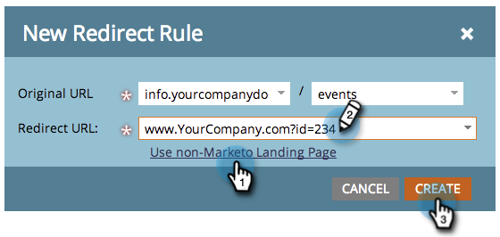

# URL 경로 리디렉션 {#redirect-a-url-path}

Marketo을 사용하면 URL 경로를 선택한 페이지에 쉽게 리디렉션할 수 있습니다. 방법은 다음과 같습니다.

>[!NOTE]
>
>**관리 권한 필요**

1. 아래 **관리**&#x200B;를 클릭합니다. **랜딩 페이지**.

   

1. 을(를) 클릭합니다. **규칙** 탭을 클릭한 다음 **새로 만들기** 및 **새 리디렉션 규칙**.

   

1. 첫 번째 **원래 URL** 드롭다운을 클릭하고 Marketo CNAME을 선택합니다.

   

   >[!NOTE]
   >
   >Marketo으로 시작하는 URL만 리디렉션할 수 있습니다 [CNAME](/help/marketo/product-docs/demand-generation/landing-pages/landing-page-actions/customize-your-landing-page-urls-with-a-cname.md).

1. 두 번째 페이지에서 리디렉션할 URL 경로(또는 특정 페이지)를 입력합니다 **원래 URL** 오른쪽에 있는 필드.

   

1. 클릭 **비Marketo 랜딩 페이지 사용**&#x200B;에 방문자를 리디렉션할 페이지를 입력합니다. **리디렉션 URL** 필드를 입력하고 **만들기**.

   

   다음을 수행할 수 있습니다 [Marketo 랜딩 페이지 사용](/help/marketo/product-docs/demand-generation/landing-pages/landing-page-actions/redirect-a-marketo-landing-page-to-another-page.md) 목적지로도 사용됩니다.

축하합니다! URL 경로를 리디렉션했습니다.

>[!MORELIKETHIS]
>
>[Marketo 랜딩 페이지를 다른 페이지로 리디렉션](/help/marketo/product-docs/demand-generation/landing-pages/landing-page-actions/redirect-a-marketo-landing-page-to-another-page.md)
