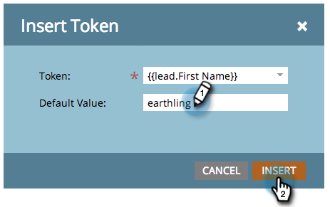

# 토큰 개요 {#tokens-overview}

토큰은 [스마트 캠페인](http://docs.marketo.com/display/DOCS/Smart+Campaigns) 흐름 단계, 이메일 [,](http://docs.marketo.com/display/DOCS/General)랜딩 페이지 [,](http://docs.marketo.com/display/DOCS/Landing+Pages)코드 조각 [, 및](http://docs.marketo.com/display/DOCS/Segmentation+and+Snippets)웹 캠페인 [캠페인에 사용할 수 있는](http://docs.marketo.com/display/public/DOCS/Using+the+Web+Personalization+Rich+Text+Editor)변수입니다.

>[!NOTE]
>
>**FYI**
>
>Marketing은 이제 모든 구독 간의 언어를 표준화하므로 구독에 리드/리드 및 docs.markto.com에 있는 사람/사람을 볼 수 있습니다. 이 용어는 같은 것을 의미한다.아티클 지침에는 영향을 주지 않습니다. 다른 변화도 있습니다 [자세한](http://docs.marketo.com/display/DOCS/Updates+to+Marketo+Terminology)내용

## 기본값 이해 {#understanding-default-values}

토큰을 사용하는 경우 기본값을 제공하려고 합니다. 참조하는 필드에 대한 값이 없는 사람을 나타내는 텍스트입니다.

이 예에서, 이메일에는 &quot;Greetings, (first name)&quot; 또는 &quot;Greetings, earthling&quot;(기본값)이 표시됩니다.

>[!CAUTION]
>
>Marketing의 이메일 편집기를 사용하는 경우 미리 머리글에서 토큰이 작동하지 않습니다. 프리헤더에서 토큰을 사용하려면 이메일 템플릿의 자체 HTML을 통해 토큰을 사용해야 합니다.

>[!NOTE]
>
>이 목록은 완전하지 않다. Marketing To에 있는 모든 사용자 정의 필드에 대한 토큰도 만들어집니다.

## 사람 토큰 {#person-tokens}

* `{{lead.Acquisition Date}}`
* `{{lead.Acquisition Program Name}}`
* `{{lead.Acquisition Program}}`
* `{{lead.Address}}`
* `{{lead.Anonymous IP}}`
* `{{lead.Black Listed}}`
* `{{lead.City}}`
* `{{lead.Country}}`
* `{{lead.Created At}}`
* `{{lead.Date of Birth}}`
* `{{lead.Department}}`
* `{{lead.Do Not Call}}`
* `{{lead.Do Not Call Reason}}`
* `{{lead.Email Address}}`
* `{{lead.Email Invalid}}`
* `{{lead.Email Invalid Cause}}`
* `{{lead.Fax Number}}`
* `{{lead.First Name}}`
* `{{lead.Full Name}}`
* `{{lead.Id}}`
* `{{lead.Inferred City}}`
* `{{lead.Inferred Company}}`
* `{{lead.Inferred Country}}`
* `{{lead.Inferred Metropolitan Area}}`
* `{{lead.Inferred Phone Area Code}}`
* `{{lead.Inferred Postal Code}}`
* `{{lead.Inferred State Region}}`
* `{{lead.Is Customer}}`
* `{{lead.Is Employee}}`
* `{{lead.Is Partner}}`
* `{{lead.Job Title}}`
* `{{lead.Last Name}}`
* `{{lead.Lead Source}}`
* `{{lead.Marketing Suspended}}`
* `{{lead.Middle Name}}`
* `{{lead.Mobile Phone Number}}`
* `{{lead.Original Referrer}}`
* `{{lead.Original Search Engine}}`
* `{{lead.Original Search Phrase}}`
* `{{lead.Original Source Info}}`
* `{{lead.Original Source Type}}`
* `{{lead.Person Notes}}`
* `{{lead.Phone Number}}`
* `{{lead.Registration Source Info}}`
* `{{lead.Registration Source Type}}`
* `{{lead.Salutation}}`
* `{{lead.SFDC Created Date}}`
* `{{lead.SFDC Is Deleted}}`
* `{{lead.SFDC Type}}`
* `{{lead.Unsubscribed}}`
* `{{lead.Unsubscribed Reason}}`
* `{{lead.Updated At}}`
* 사용자 정의 개인 필드는 표시 이름을 사용하는 경우에도 작동합니다. 예를 들면 `{{lead.Custom Field Name}}`

## 회사 토큰 {#company-tokens}

* `{{Company.Account Owner Email Address}}`
* `{{Company.Address}}`
* `{{Company.Annual Revenue}}`
* `{{Company.City}}`
* `{{Company.Company Name}}`
* `{{Company.Company Notes}}`
* `{{Company.Country}}`
* `{{Company.Industry}}`
* `{{Company.Main Phone}}`
* `{{Company.Num Employees}}`
* `{{Company.Parent Company Name}}`
* `{{Company.Postal Code}}`
* `{{Company.SFDC Account Num}}`
* `{{Company.SFDC Created Date}}`
* `{{Company.SFDC Type}}`
* `{{Company.SIC Code}}`
* `{{Company.Site}}`
* `{{Company.State}}`
* `{{Company.Website}}`
* 사용자 지정 회사 필드는 표시 이름을 사용한 경우에도 작동합니다. `{{Company.Custom Field Name}}`

## 캠페인 토큰 {#campaign-tokens}

* `{{campaign.name}}`
* `{{campaign.id}}`
* `{{campaign.description}}`

## 시스템 토큰 {#system-tokens}

>[!NOTE]
>
>이러한 토큰에 대한 자세한 내용은 [시스템 토큰 용어집을 참조하십시오](/help/marketo/product-docs/email-marketing/general/using-tokens/system-tokens-glossary.md).

* `{{system.date}}`
* `{{system.time}}`
* `{{system.dateTime}}`
* `{{system.forwardToFriendLink}}`
* `{{system.unsubscribeLink}}`
* `{{system.viewAsWebpageLink}}`

## 트리거 토큰 {#trigger-tokens}

* `{{trigger.Trigger Name}}`
* `{{trigger.Name}}`
* `{{trigger.Link}}`
* `{{trigger.Subject}}`
* `{{trigger.Category}}`
* `{{trigger.Details}}`
* `{{trigger.Web Page}}`
* `{{trigger.Client IP Address}}`
* `{{trigger.Sent By}}`
* `{{trigger.Received By}}`
* `{{trigger.Referrer}}`
* `{{trigger.Search Engine}}`
* `{{trigger.Search Query}}`

>[!NOTE]
>
>스마트 캠페인에 사용된 트리거를 기반으로 [흥미로운 순간에](/help/marketo/product-docs/marketo-sales-insight/msi-for-salesforce/features/tabs-in-the-msi-panel/interesting-moments/tokens-for-interesting-moments.md) 토큰에 대한 자세한 내용을 확인할 수 있습니다.

## 프로그램 토큰 {#program-tokens}

* `{{program.Name}}`

* `{{program.Description}}`

* `{{program.id}}`

## 내 토큰 {#my-tokens}

내 토큰은 프로그램 내에서 정의되고 토큰에 대해 만든 이름으로 `{{my.` 시작합니다. 프로그램의 [내 토큰에 대해 자세히 알아보십시오](/help/marketo/product-docs/core-marketo-concepts/programs/tokens/understanding-my-tokens-in-a-program.md).

## 멤버 토큰 {#member-token}

멤버 토큰은 통합 서비스 파트너의 고유한 값을 삽입하는 데 사용됩니다. 공통 용도는 웨비나 참석자를 위한 고유한 URL입니다. 각 사람에게는 `{{member.webinar url}}` 토큰을 사용하여 삽입할 수 있는 웨비나에 액세스할 수 있는 고유한 URL이 있습니다. 이 `{{member.webinar url}}` 토큰은 서비스 공급자가 생성한 개인의 고유한 확인 URL을 자동으로 확인합니다.

* `{{member.webinar url}}`

>[!CAUTION]
>
>토큰은 이메일을 보내는 스마트 캠페인이 이벤트 프로그램의 하위 자산인 경우에만 채워집니다. `{{member.webinar url}}`
