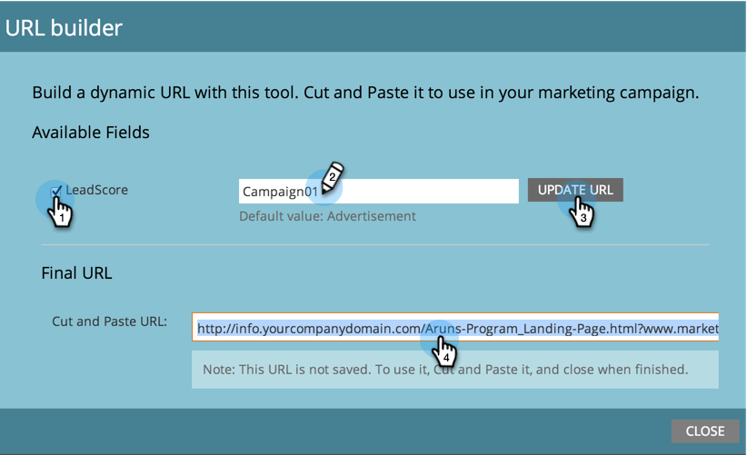

# URL 빌더 {#using-the-url-builder} 사용

URL 빌더를 사용하면 Marketing to 숨김 양식 필드를 채울 수 있는 URL을 만들 수 있습니다.

>[!PREREQUISITES]
>
>양식에 숨김 필드를 만들고 [양식 필드를 숨김](/help/marketo/product-docs/demand-generation/forms/form-fields/set-a-form-field-as-hidden.md)으로 설정하는 방법을 알아봅니다.

1. 랜딩 페이지를 선택하고 **랜딩 페이지 작업**&#x200B;을 클릭한 다음 **URL 도구**&#x200B;를 가리키고 **URL 빌더**&#x200B;를 클릭합니다.

   

1. 사용할 필드를 선택하고 값을 입력한 다음 **URL 업데이트**&#x200B;를 클릭합니다.

   

   >[!NOTE]
   >
   >빌더에서 사용할 수 있는 필드가 없는 경우 양식에 숨김 필드가 있으며 해당 필드가 [URL 매개 변수](/help/marketo/product-docs/demand-generation/forms/form-fields/set-a-hidden-form-field-value.md#url-parameter)를 허용하도록 설정되어 있는지 확인하십시오.

멋진 작품! 이제 URL을 복사하여 웹에 붙여넣고 사용할 수 있습니다.
