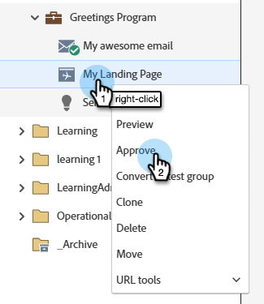
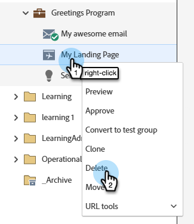

# 랜딩 페이지 승인, 승인 취소 또는 삭제 {#approve-unapprove-or-delete-a-landing-page}

승인할 때까지 랜딩 페이지는 초안 모드에 있습니다. 승인을 하면 나머지 시스템에서 페이지를 사용할 수 있습니다. 승인된 랜딩 페이지를 편집하면 Marketo Engage이 초안을 저장하지만 초안을 승인할 때까지 승인된 버전을 계속 사용합니다.

## 랜딩 페이지 승인 {#approve-a-landing-page}

1. 원하는 랜딩 페이지를 선택하고 을(를) 클릭하고 **[!UICONTROL Approve draft]**&#x200B;을(를) 클릭합니다.

   

   >[!TIP]
   >
   >원하는 경우 [한 번에 여러 페이지를 승인](/help/marketo/product-docs/demand-generation/landing-pages/landing-page-actions/approve-multiple-landing-pages-at-once.md)할 수 있습니다.

왼쪽 탐색 메뉴에서 랜딩 페이지를 마우스 오른쪽 단추로 클릭하고 **[!UICONTROL Approve]**&#x200B;을(를) 선택할 수도 있습니다.

>[!NOTE]
>
>승인된 랜딩 페이지에 녹색 확인 표시가 추가되었습니다.

## 랜딩 페이지 승인 취소 {#unapprove-a-landing-page}

1. 원하는 랜딩 페이지를 선택하고 **[!UICONTROL Unapprove]**&#x200B;을(를) 클릭합니다.

   

왼쪽 탐색 메뉴에서 랜딩 페이지를 마우스 오른쪽 단추로 클릭하고 **[!UICONTROL Unapprove]**&#x200B;을(를) 선택할 수도 있습니다.

>[!NOTE]
>
>승인되지 않은 랜딩 페이지는 더 이상 웹에 게시되지 않으며 추가 활동을 생성하지 않습니다. 승인되지 않은 랜딩 페이지 및 Facebook 탭 방문자에게 [대체 페이지](/help/marketo/product-docs/administration/settings/set-a-fallback-page.md)가 표시됩니다.

## 랜딩 페이지 삭제 {#delete-a-landing-page}

1. 원하는 랜딩 페이지를 선택합니다. **[!UICONTROL Landing Page Actions]** 드롭다운을 클릭하고 **[!UICONTROL Delete]**&#x200B;를 선택합니다.

   

   >[!IMPORTANT]
   >
   >승인된 랜딩 페이지는 삭제할 수 없습니다. 먼저 승인을 취소해야 합니다.

왼쪽 탐색 메뉴에서 랜딩 페이지를 마우스 오른쪽 단추로 클릭하고 **[!UICONTROL Delete]**&#x200B;을(를) 선택할 수도 있습니다.

## 여러 랜딩 페이지 삭제 {#delete-multiple-landing-pages}

1. 기본 [!UICONTROL Design Studio] 화면에서 **[!UICONTROL Landing Pages]**&#x200B;을(를) 클릭합니다.

   

1. 원하는 랜딩 페이지를 선택합니다. **[!UICONTROL Landing Page Actions]** 드롭다운을 클릭하고 **[!UICONTROL Delete]**&#x200B;를 선택합니다.

   

1. **[!UICONTROL Delete]**&#x200B;을(를) 클릭하여 확인합니다.

   
