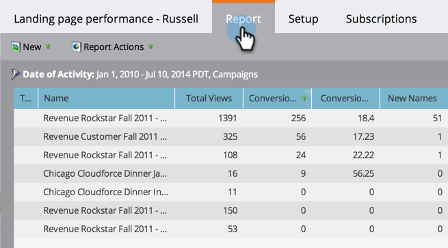

# 랜딩 페이지 성능 보고서 {#landing-page-performance-report}

얼마나 많은 사람들이 여러분의 `forms` 안에서 그 `landing pages`를 채웠으며, 얼마나 많은 사람들이 새로운 사람이었는지를 살펴보십시오.

1. [보고서를](../../../../product-docs/reporting/basic-reporting/creating-reports/create-a-report-in-a-program.md) 만들고 랜딩 페이지 성능 [보고서 유형을 선택합니다](../../../../product-docs/reporting/basic-reporting/report-types/report-type-overview.md).
1. [보고서](../../../../product-docs/reporting/basic-reporting/editing-reports/change-a-report-time-frame.md) 기간을 설정하고 보고서 탭을 클릭합니다.
1. 바로 그거야! 랜딩 페이지의 품질을 평가하려면 보고서를 참조하십시오.

   

   랜딩 페이지 성과 보고서의 열 중 전환 및 전환 비율은 사용자가 양식을 작성한 횟수를 반영합니다.

   >[!TIP]
   >
   >전환 비율이 가장 높은 페이지를 찾습니다. [해당 열에 대한 보고서를](../../../../product-docs/reporting/basic-reporting/editing-reports/sort-report-on-columns.md) 정렬하고 내림차순 정렬을 선택합니다.

   보고서의 AB 아이콘은 통계가 해당 [랜딩 페이지 테스트 그룹의 모든 페이지에 대한 합계임을 나타냅니다](landing-page-test-groups.md).

1. 오른쪽으로 스크롤하여 다양한 소셜 미디어 플랫폼에서 발생한 방문 횟수를 확인합니다.

   

>[!NOTE]
>
>분석으로 [소셜 단추에서 생성된 활동은 여기에](../../../../product-docs/demand-generation/landing-pages/free-form-landing-pages/add-a-social-button-to-a-free-form-landing-page.md) 포함되지 않습니다. 이러한 통계를 보려면 [소셜 대시보드를 참조하십시오](../../../../product-docs/demand-generation/social/social-functions/view-social-performance.md).

>[!NOTE]
>
>**딥 다이브**
>
>기본 보고의 다른 흥미로운 보고서에 대해 자세히 [알아보십시오](http://docs.marketo.com/display/docs/basic+reporting) .

>[!NOTE]
>
>**관련 문서**
>
>* [랜딩 페이지 성과 보고서를](../../../../product-docs/demand-generation/landing-pages/landing-page-actions/filter-a-landing-page-performance-report.md) 로컬 또는 전역 자산별로 필터링합니다.

>

