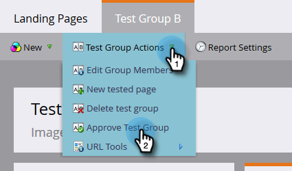

# 랜딩 페이지 테스트 그룹 {#landing-page-test-groups}

Marketo은 테스트 그룹 내에서 테스트된 각 페이지의 페이지 보기 수 및 양식 완료 수를 추적합니다. 테스트 그룹 결과를 사용하여 가장 매력적인 랜딩 페이지를 결정할 수 있습니다. 테스트 그룹을 만드는 방법은 다음과 같습니다.

>[!PREREQUISITES]
>
>[두 개 이상의 랜딩 페이지를 빌드](/help/marketo/getting-started/quick-wins/landing-page-with-a-form.md)합니다. 양식으로 빌드하는 것이 좋습니다.

1. Design Studio에서 **[!UICONTROL New]**&#x200B;을(를) 클릭합니다. 드롭다운에서 **[!UICONTROL New Test Group]**&#x200B;을(를) 선택합니다.

   

   >[!NOTE]
   >
   >테스트 그룹을 만드는 다른 방법은 다음과 같습니다.
   >
   >* 트리에서 랜딩 페이지를 마우스 오른쪽 단추로 클릭하고 **[!UICONTROL Convert to Test Group]**&#x200B;을(를) 선택합니다.
   >* **[!UICONTROL AB Test Group]** 메뉴에서 **[!UICONTROL New Local Asset]**&#x200B;을(를) 선택하여 프로그램에서 랜딩 페이지 테스트 그룹을 만듭니다.

1. 이름 및 설명(선택 사항)을 입력합니다. 테스트할 랜딩 페이지를 선택하고 **[!UICONTROL Create]**&#x200B;을(를) 클릭합니다.

   

   >[!NOTE]
   >
   >승인되지 않은 랜딩 페이지만 선택할 수 있습니다.

1. 각 랜딩 페이지를 마우스 오른쪽 단추로 클릭하고 **[!UICONTROL Approve]**&#x200B;을(를) 선택합니다.

   

1. **[!UICONTROL Test Group Actions]** 드롭다운을 클릭하고 **[!UICONTROL Approve Test Group]**&#x200B;을(를) 선택합니다.

   

   됐습니다. 이제 선택한 랜딩 페이지의 상태를 비교할 수 있습니다.

   

   >[!TIP]
   >
   >테스트 그룹을 삭제하려면 **[!UICONTROL Test Group Actions]**&#x200B;을(를) 클릭하고 **[!UICONTROL Delete test group]**&#x200B;을(를) 선택하십시오.
