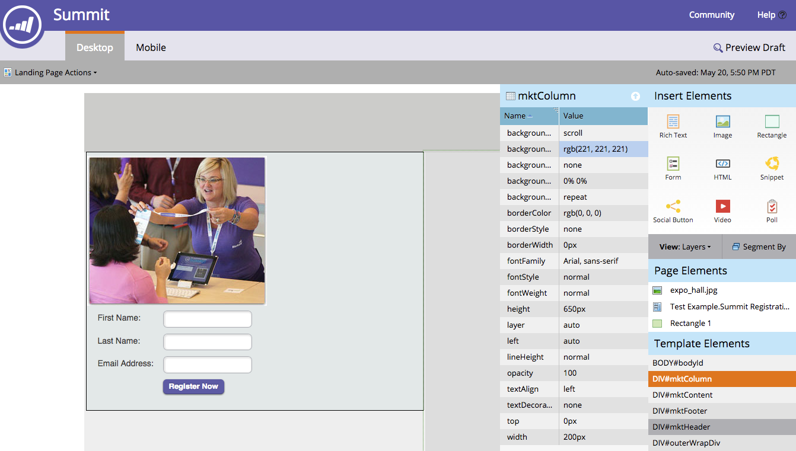

# 자유 양식과 안내 랜딩 페이지 이해 {#understanding-free-form-vs-guided-landing-pages}

선택하는 템플릿에 따라 작업할 랜딩 페이지 편집 모드가 결정됩니다. 다음 두 가지 경로가 가능합니다. [자유로운 형태](http://docs.marketo.com/display/docs/free-form+landing+pages) 및 [안내](http://docs.marketo.com/display/docs/guided+landing+pages). 아래에서 중요한 차이점에 대한 간단한 요약을 확인할 수 있습니다.

## 자유로운 페이지 {#free-form-pages}

* 원하는 컨텐츠를 원하는 위치에 드래그하여 놓을 수 있습니다.
* 템플릿은 PowerPoint의 슬라이드 마스터와 같습니다. 단지 백그라운드입니다.
* 한 번의 클릭으로 간단한 모바일 버전의 페이지를 만들 수 있습니다.
* 시간 또는 기술 리소스를 많이 사용하지 못할 때 가장 많이 사용됩니다.

## 안내 페이지 {#guided-pages}

* 템플릿을 기반으로 미리 정의된 레이아웃/구조입니다.
* 템플릿에서 편집할 수 있다고 정의된 영역이나 변수만 편집기에서 사용자 지정할 수 있습니다.
* 레이아웃을 수정하고 자산을 추가하는 데 필요한 코드 변경 사항입니다.
* 템플릿에 내장된 규칙으로 결정된 디바이스에서 모양과 느낌
* 반응형 템플릿을 코딩하거나 구입했거나 미리 만들어진 마케팅 템플릿 수정을 원하는 경우에 가장 적합합니다.

>[!MORELIKETHIS]
>
>* [자유형 랜딩 페이지](http://docs.marketo.com/display/public/DOCS/Free-Form+Landing+Pages)
>* [안내 랜딩 페이지](http://docs.marketo.com/display/DOCS/Guided+Landing+Pages)

>

