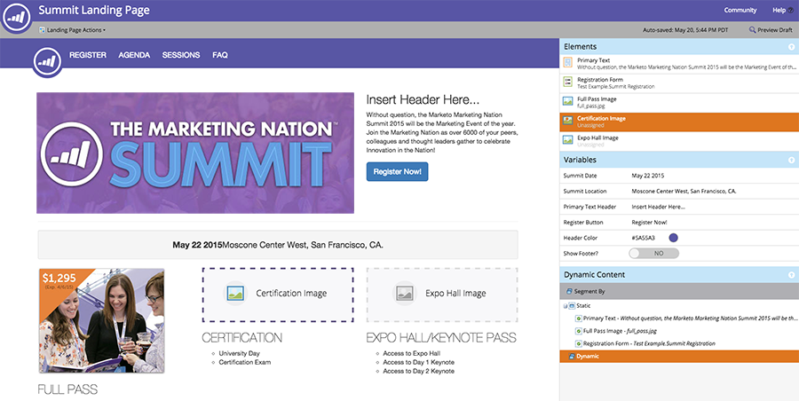

# 자유 형식 랜딩 페이지와 가이드 랜딩 페이지 이해 {#understanding-free-form-vs-guided-landing-pages}

선택하는 템플릿에 따라 작업할 랜딩 페이지 편집 모드가 결정됩니다. 가능한 경로는 [자유 형식](/help/marketo/product-docs/demand-generation/landing-pages/free-form-landing-pages/create-a-free-form-landing-page.md)과(와) [안내](/help/marketo/product-docs/demand-generation/landing-pages/guided-landing-pages/create-a-guided-landing-page.md)입니다. 아래에서 중요한 차이점에 대한 간단한 요약을 확인할 수 있습니다.

## 자유 형식 페이지 {#free-form-pages}

* 원하는 컨텐츠를 원하는 위치에 드래그하여 놓습니다.
* 템플릿이 [!DNL PowerPoint]의 [!DNL SlideMaster]과(와) 같습니다. 배경입니다.
* 한 번의 버튼 클릭으로 페이지의 간단한 모바일 버전을 만들 수 있습니다.
* 가장 좋은 방법은 시간이나 기술 리소스가 많이 없을 때 사용하는 것입니다.

## 안내식 페이지 {#guided-pages}

* 템플릿에 의해 제어되는 사전 정의된 레이아웃/구조.
* 템플릿에서 편집 가능한 것으로 정의된 영역 또는 변수만 편집기에서 사용자 정의할 수 있습니다.
* 레이아웃을 수정하고 자산을 추가하는 데 필요한 코드 변경 사항입니다.
* 템플릿에 내장된 규칙에 따라 결정된 디바이스를 살펴보고 느낍니다.
* 응답형 템플릿을 코딩 또는 구매했거나 사전 빌드된 Marketo 템플릿을 수정하려는 경우 가장 적절하게 사용됩니다.

