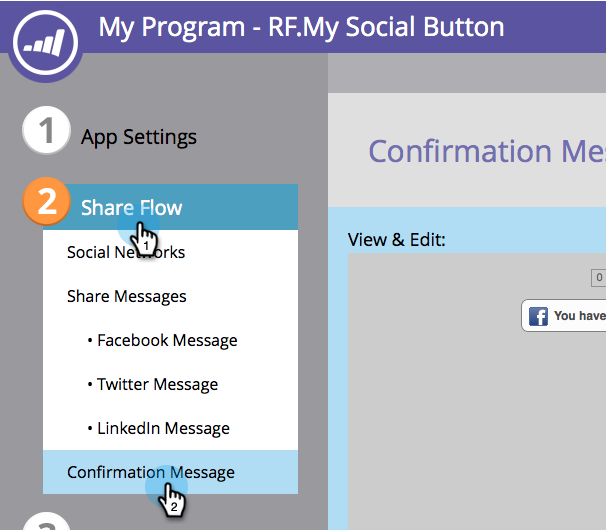

# 공유 후 프롬프트 구성 {#configure-after-share-prompts}

소셜 단추, 비디오 공유 및 투표 앱에서 사용자가 소셜 네트워크에 있는 콘텐츠를 공유한 후 발생하는 일을 선택할 수 있습니다.

1. **마케팅 활동**&#x200B;으로 이동합니다.

   

1. 앱을 선택하고 **초안 편집**&#x200B;을 클릭합니다.

   

1. 소셜 앱 편집기에서 **앱 설정**&#x200B;으로 이동한 다음 **고급 옵션**&#x200B;으로 이동합니다.

   

1. **공유 후**&#x200B;에서 원하는 비헤이비어를 선택합니다.

   

   * **확인 메시지:** 한 사람이 공유되면 확인 메시지가 표시됩니다.
   * **이메일 캡처:** 공유한 사람이 이메일 주소를 요청합니다.

   >[!NOTE]
   >
   >**이메일 캡처**&#x200B;를 선택하면 사용자가 해당 정보를 아직 제공하지 않은 경우에만 요청이 표시됩니다.

1. **확인 메시지:**&#x200B;공유 흐름&#x200B;**으로 이동한 다음**&#x200B;확인 메시지&#x200B;**로 이동합니다.**

   

1. 확인 메시지를 편집합니다.

   

1. **이메일 캡처**&#x200B;를 선택한 경우(확인 대신):**공유 흐름**&#x200B;으로 이동한 다음 **이메일 캡처**&#x200B;로 이동합니다.

   

1. 마케팅 메시지를 포함할지 여부 및 해당 확인란을 기본적으로 선택할지(**옵트아웃**) 여부를 선택합니다(**옵트인**).

   

1. 이메일 주소 요청과 마케팅 메시지를 편집합니다(이메일 주소를 포함시킨 경우).

   
