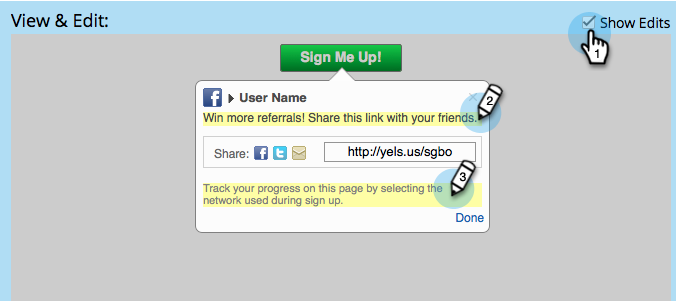

# 전자 메일 다시 공유 구성 및 소셜 앱 {#configure-re-share-email-and-prompt-for-a-social-app} 확인

[참조 오퍼](/help/marketo/product-docs/demand-generation/social/referral-offers/create-a-referral-offer.md) 또는 [경품 행사](/help/marketo/product-docs/demand-generation/social/sweepstakes/create-sweepstakes.md)를 만들 때 참가자를 초대하여 등록 프로세스의 일부로 더 많은 친구들과 오퍼를 공유하고 공유 이메일에 대한 기본 텍스트를 제공할 수 있습니다.

>[!NOTE]
>
>추천 오퍼에서 [오퍼를 공유하여 등록하기 위한 요구 사항](/help/marketo/product-docs/demand-generation/social/social-functions/set-social-share-requirement.md)으로 설정할 수도 있습니다.

1. **마케팅 활동**&#x200B;으로 이동합니다.

   

1. 참조 오퍼를 선택하고 **초안 편집**&#x200B;을 클릭합니다.

   

1. 참조 오퍼 편집기에서 **등록 흐름** > **다시 공유 프롬프트**&#x200B;로 이동합니다.

   

1. 공유하기로 선택한 참가자의 친구가 받을 이메일을 편집합니다.

   >[!NOTE]
   >
   >이메일에는 참가자의 고유한 공유 URL이 자동으로 포함됩니다.

1. **보기 및 편집** 창에서 **편집 내용 표시**&#x200B;를 클릭하고 공유 초대장과 추적 진행 지침을 편집합니다.

   

>[!MORELIKETHIS]
>
>다음으로 참조 오퍼](configure-track-progress-flow-for-a-referral-offer.md)에서 [진행 흐름 추적 처리를 구성하거나 **완료** > **승인 및 닫기**&#x200B;를 클릭하여 참조 오퍼](/help/marketo/product-docs/demand-generation/social/referral-offers/publish-a-referral-offer.md) 또는 [경품 행사](/help/marketo/product-docs/demand-generation/social/sweepstakes/create-sweepstakes.md)를 게시할 수 있습니다.[
