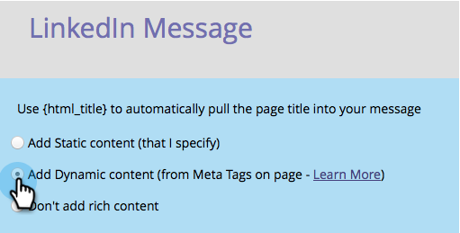

# 소셜 추천 흐름 구성 {#configure-social-recommend-flow}

소셜 앱을 만들 때 소셜 네트워크 선택 사항을 구성하고 사용자가 등록하면 표시되는 메시지를 표시할 수 있습니다.

## 공유할 네트워크 선택 {#select-networks-for-sharing}

>[!NOTE]
>
>소셜 [등록/공유 흐름을 구성하는](configure-social-sign-up-share-flow.md)것과 매우 비슷하지만 소셜 앱 *아래의* 공유 링크에사용됩니다.

1. 마케팅 활동 **으로 이동합니다**.

   

1. 앱을 선택하고 초안 **편집***.*

   

1. 소셜 앱 편집기에서 **추천 흐름** > **소셜 네트워크***.**로 이동합니다.

   

1. 사용자가 공유할 수 있는 네트워크를 선택합니다.

   

## Facebook 메시지 구성 {#configure-the-facebook-message}

1. Facebook 게시물에 표시되는 메시지를 구성합니다.

   

   >[!NOTE]
   >
   >비디오 공유에서 축소판은 자동으로 생성됩니다.

   **동적**&#x200B;컨텐츠 추가정적 컨텐츠 추가**를 선택한 경우 제목, 캡션 및 설명을 입력하고 이미지를 업로드합니다. 다음 두 단계를 참조하십시오.

1. 보기 및 편집 창에서 편집 **표시** 를 클릭하여 Facebook 게시물에 표시되는 공유 프롬프트 및 메시지를 사용자 지정합니다.

   >[!TIP]
   >
   >자세한 내용은 Facebook [리치 게시물 설정 편집을 참조하십시오](../../../../product-docs/demand-generation/facebook/edit-facebook-rich-post-settings.md).

   

   >[!NOTE]
   >
   >공유 [URL은](../../../../product-docs/demand-generation/social/social-functions/choose-the-share-url-for-a-social-app.md) 모든 공유 메시지에 자동으로 추가됩니다.

1. 위에서 정적 **컨텐츠** 추가 **를 선택한** 경우 제목, 캡션 및 설명을 편집하고 사용자 지정 이미지(마케팅 이미지 및 파일)를 업로드합니다.

   

   Marketing [에 이미지 및 파일 추가를 참조하십시오](../../../../product-docs/demand-generation/images-and-files/add-images-and-files-to-marketo.md).

   >[!NOTE]
   >
   >이미지를 업로드하면 소셜 앱 편집기를 닫았다가 다시 열기 전까지 여기에 표시되지 않습니다.

1. 다음을 **클릭합니다**.

선택하는 경우 페이지의 OpenGraph 태그(og:title, og:caption 및 og:description)와 축소판 값이 Facebook 게시물에 자동으로 추가됩니다. 다음 단계를 참조하십시오.

## Twitter 메시지 구성 {#configure-the-twitter-message}

1. Twitter 트윗에 표시되는 공유 프롬프트 및 메시지를 편집하려면 클릭합니다.

   

   >[!TIP]
   >
   >트윗 텍스트에 {html_title}을(를) 사용하여 페이지의 제목을 자동으로 표시합니다.

1. 다음을 **클릭합니다**.

## LinkedIn 메시지 구성 {#configure-the-linkedin-message}

1. LinkedIn 게시물에 표시되는 메시지를 구성합니다.

   

   동적 **컨텐츠 추가를 선택하면 페이지** 태그(제목 및 설명) 및 축소판의 값이 LinkedIn 게시물에 자동으로 추가됩니다. 다음 단계를 참조하십시오.

   [정적 컨텐츠 **추가** ]를 선택한 경우 제목, 캡션 및 설명을 입력하고 이미지를 업로드합니다. 다음 두 단계를 참조하십시오.

1. 보기 **및** **편집****창** 에서 편집표시를 클릭하고 LinkedIn 게시물에 표시되는 공유 프롬프트 및 메시지를 편집합니다.

   

   >[!TIP]
   >
   >게시물 텍스트에 {html_title}을(를) 사용하여 페이지의 제목을 자동으로 표시합니다.

1. 위에서 정적 **컨텐츠** 추가를 선택한 경우 제목과 설명을 편집하고 사용자 지정 이미지(마케팅 이미지 및 파일&#x200B;****&#x200B;에서)를 업로드합니다.

   

   Marketing [에 이미지 및 파일 추가를 참조하십시오](../../../../product-docs/demand-generation/images-and-files/add-images-and-files-to-marketo.md).

   >[!NOTE]
   >
   >이미지를 업로드하면 소셜 앱 편집기를 닫았다가 다시 열기 전까지 여기에 표시되지 않습니다.

1. 다음을 **클릭합니다**.

## 확인 메시지 구성 {#configure-the-confirmation-message}

1. 공유 확인 텍스트를 편집합니다.

   

1. 마침 **> 승인** **및** **닫기****.*

   

>[!NOTE]
>
>**관련 문서**
>
>다음 단계는 [비디오 공유](customize-video-share-flow.md) 또는 [투표를 랜딩 페이지, Facebook](../../../../product-docs/demand-generation/social/creating-a-poll/create-a-poll.md) 또는 자체 웹 사이트에 추가하는 것입니다.

