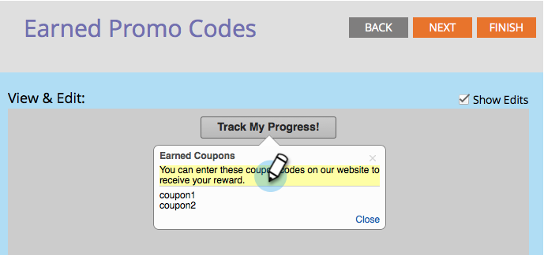

# 참조 오퍼 {#configure-track-progress-flow-for-a-referral-offer}에 대한 추적 진행 흐름 구성

[참조 오퍼](../../../../product-docs/demand-generation/social/referral-offers/create-a-referral-offer.md)를 만들 때 참가자가 상금에 대한 진행 상황을 표시하는 알림을 구성할 수 있습니다.

1. **마케팅 활동**&#x200B;으로 이동합니다.

   

1. 참조 오퍼를 선택하고 **초안 편집**&#x200B;을 클릭합니다.

   

1. 참조 오퍼 편집기에서 **진행 흐름 추적** > **소셜 네트워크**&#x200B;로 이동합니다.

   

1. **보기** **&amp;** **편집** 창에서 참가자가 오퍼에 가입하기 위해 사용한 것과 동일한 소셜 네트워크에 로그인하도록 상기시키는 메시지를 편집합니다.

   

   >[!NOTE]
   >
   >편집할 수 있는 텍스트를 강조 표시하려면 오른쪽 위 모서리에서 **편집 내용 표시**&#x200B;를 선택합니다.

1. 참가자가 다른 친구와 링크를 공유할 수 있도록 하는 메시지를 편집합니다.

   

1. 참가자에게 이행 목표를 달성했고 해당 이메일을 확인하라는 메시지를 편집합니다.

   

1. 보상을 확인하기 위해 성공적인 참가자에게 관련 프로모션 코드에 대해 알리는 메시지를 편집합니다.

   

>[!MORELIKETHIS]
>
>그런 다음 **완료 > 승인 및 닫기** 및 [참조 오퍼](../../../../product-docs/demand-generation/social/referral-offers/publish-a-referral-offer.md)게시를 클릭합니다.

