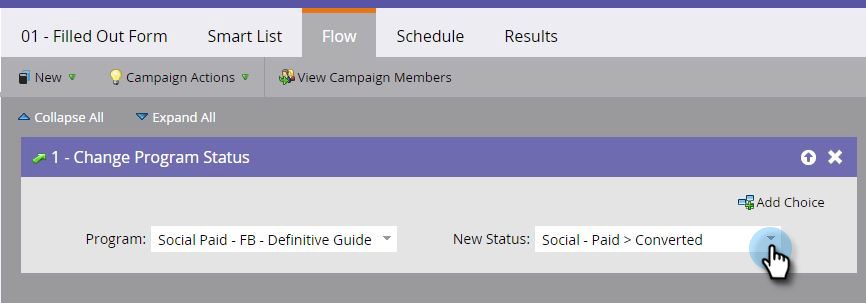

# 디지털 광고 캠페인에 대한 매출 속성 설정 {#set-up-revenue-attribution-for-digital-advertising-campaigns}

>[!NOTE]
>
>**FYI**
>
>Marketing은 이제 모든 구독 간의 언어를 표준화하므로 구독에 리드/리드 및 docs.markto.com에 있는 사람/사람을 볼 수 있습니다. 이 용어는 같은 것을 의미한다.아티클 지침에는 영향을 주지 않습니다. 다른 변화도 있습니다 [자세한](http://docs.marketo.com/display/DOCS/Updates+to+Marketo+Terminology)내용

디지털 광고 채널 및 캠페인에 대한 매출 기여도를 설정하는 방법은 다음과 같습니다. 설정한 후에는 다른 Marketing 프로그램과 마찬가지로 디지털 광고에 대해 첫 번째 터치 및 다중 터치 매출 속성을 수행할 수 있습니다.

Marketing to에서 첫 번째 광고 프로그램을 설정한 후 다른 채널용으로 복제하여 업데이트할 수 있습니다. 예를 들어 LinkedIn 프로그램을 Facebook에 복제합니다.

별도의 프로그램을 통해 각 프로그램의 전환 수를 추적하고 프로그램 분석기, 기회 영향 분석기 및 기타 Marketing to Analytics 기능에서 프로그램을 확인할 수 있습니다.

>[!NOTE]
>
>**사전 요구 사항**
>
>* 상태 값 및 프로그램 성공(예: 디지털 광고 또는 소셜 유료 및 PPC)을 포함하는 채널 태그 설정
>* 양식을 만들거나 편집하여 개인 사용자와 쿼리 문자열 전달
>* 광고 채널 및 캠페인에 대해 보고하려면 일부 매출 주기 분석 기능에 액세스할 수 있어야 합니다

>

## 기본 프로그램 만들기 {#create-a-default-program}

특정 기간 동안 주기적으로 실행되는 일부 프로그램(예: 이메일)과 달리 기본 프로그램은 항상 켜져 있습니다.

1. 마케팅 활동 **으로 이동합니다**.

   

1. 새로 **만들기를** 클릭하고 **새 프로그램을 선택합니다**.

   

1. 이미 적절한 프로그램을 가지고 있는 경우 [복제할 수 있습니다](../../../../product-docs/core-marketo-concepts/programs/working-with-programs/clone-a-program.md).

   >[!TIP]
   >
   >프로그램을 복제할 때마다 스마트 목록의 쿼리 문자열 필드에 있는 이름을 바꾸십시오.

1. 초기 프로그램이 설정된 후에 새 프로그램을 특정 캠페인 폴더에 배치합니다.

   >[!NOTE]
   >
   >**예**
   >
   >
   >URL을 통해 전달된 쿼리 문자열은 Marketing To에서 사용자가 되었을 때 사용자가 클릭한 광고 캠페인을 파악하는 데 도움이 됩니다.
   >
   >
   >측정할 모든 변수를 포함하는 쿼리 문자열 방법을 만들 수 있습니다. Marketing에서는 이러한 변수를 사용하여 다른 프로그램에 사용자를 추가합니다.
   >
   >
   >예를 들어 채널 유형_Channel_Asset_Region을 사용할 수 있습니다. 다음과 같습니다.SP_FB_NewGuide_US. **참고**:약어는 공백을 저장합니다.
   >
   >
   >또는 Channel_Adsource_AssetName_Region_UniqueIdNumber로 설정합니다. 다음과 같습니다.Social-Paid_Facebook_NewGuide_NA_123.

## 새 이름에 대한 스마트 캠페인 만들기 {#create-a-smart-campaign-for-new-names}

1. 스마트 캠페인에서 표시되는 것처럼 두 개의 트리거와 두 개의 필터가 포함된 스마트 목록을 만듭니다.

   

   >[!NOTE]
   >
   >두 개의 트리거에서 사용되는 쿼리 문자열 및 **캡처된 프로그램 이름** 필터는 고유한 것입니다. 여기에 표시된 쿼리 문자열은 예에만 있습니다. 필드를 복제한 경우 이러한 필드를 교체하면 됩니다.

1. 속성을 획득 프로그램으로 **** 변경하고 새 값을 유료 소셜 캠페인에 대해 정의한 값으로 설정하는 흐름 단계를 만듭니다.

   

1. 캠페인을 예약하고 활성화합니다.

## 상태/프로그램 성공에 대한 스마트 캠페인 만들기 {#create-a-smart-campaign-for-status-program-success}

사람들의 상태를 바꾸기 위해 두 번째 스마트 캠페인이 필요합니다. 그러면 프로그램 성공을 달성하고 매출 속성 계산에 포함될 수 있습니다.

1. 양식 **채우기** 트리거에 쿼리 문자열에 프로그램 이름을 입력합니다. 프로그램을 복제하는 경우 이전 쿼리 문자열 이름을 새 쿼리 문자열 이름으로 바꾸기만 하면 됩니다.

   

1. 플로우 단계를 만들어 상태를 프로그램 성공과 연관된 단계로 변경합니다.

   

   >[!NOTE]
   >
   >위의 예는 **Converted, **를 표시하지만 이것은 상태/성공 값에 따라 다릅니다.

1. 캠페인을 예약하고 활성화합니다.

## 광고 만들기 {#create-your-ad}

프로그램과 캠페인을 설정한 후 새 광고를 만듭니다.

1. 채널로 이동예: LinkedIn 또는 Facebook.
1. 새 광고를 만듭니다.
1. 캠페인의 클릭유도문안 작업에 대한 대상으로 마케팅 랜딩 페이지를 선택합니다.
1. 쿼리 문자열을 URL에 추가합니다.

   >[!NOTE]
   >
   >**예**
   >
   >
   >설정한 모든 정보를 실제 URL에 추가하는 방법은 다음과 같습니다. 항목은 앰퍼샌드(&amp;)로 구분됩니다.
   >
   >
   >[www.marketo.com?**source**=Social-Paid&amp;**comment**=Social-Paid_Facebook_NewGuide_NA&amp;**camp**=abc&amp;**kk=**xyz](http://www.marketo.com?source=Social-Paid&amp;comment=Social-Paid_Facebook_NewGUide_NA&amp;camp=abc&amp;kk+xyz)
   >
   >    
   >    
   >    * **source** is the Person Source used as a channel identifier
   >    * **comment** is the unique identifier for each program
   >    * **camp** is a campaign in Facebook, LinkedIn, or Google
   >    * **k** is the keyword or asset name you want to capture

   >    
   >    
   >**이 네 가지 용어는 모두 소문자여야 하며 이 정보를 캡처하려면 URL에 공백이 없어야 합니다.**

## 모범 사례 {#best-practices}

단일 채널 태그를 사용하여 모든 디지털 광고를 나타내거나, 다른 마케팅 채널(예: 소셜 유료, 검색 유료, 디스플레이, 재타깃팅)과 보다 세부적인 비교를 원하는 경우 여러 채널 태그를 사용하십시오.

그런 다음 필요한 각 보고 보기에 대해 다른 프로그램을 설정합니다. 10개 지역이 함께 &quot;큰 캠페인&quot;을 시작하고 여러 지역에서 결과를 보려는 경우 쿼리 문자열에 URL(예: BC)의 매개 변수로 공통 ID를 사용하십시오.

각 지역 및 빅캠페인의 집단 결과를 보고하려면 11개의 프로그램(각 지역에 대해 1개, 큰 캠페인에 대해 1개)을 만듭니다. 각 프로그램은 쿼리 문자열(예: BC)의 관련 문자만 참조합니다.

빅캠페인과 지역 프로그램 간에 의도적인 중복 항목이 있으므로, 일부 사람들이 빅캠페인과 지역 프로그램 중 하나에 속해 있으므로, 11개 프로그램 모두에서 총 인구 수를 보고하는 것을 원하지 않을 것입니다.
