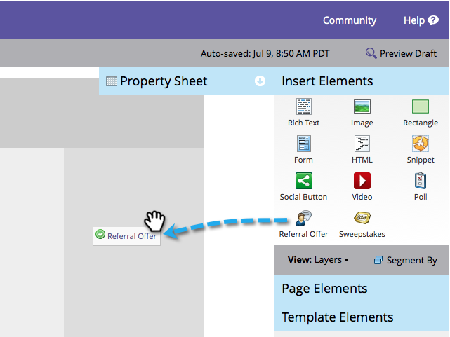

# 참조 오퍼 게시 {#publish-a-referral-offer}

[참조 오퍼](create-a-referral-offer.md)를 만든 후 마케팅 랜딩 페이지, Facebook 및 웹 사이트에 게시할 수 있습니다.

1. 랜딩 페이지로 이동하여 편집을 위해 엽니다.

   

1. 오른쪽의 팔레트에서 **참조 오퍼** 위로 드래그합니다.

   

1. 참조 오퍼를 선택하고 **삽입**&#x200B;을 클릭합니다.

   

>[!NOTE]
>
>**미리 알림**
>
>여기에서 오퍼를 사용할 수 있도록 하려면 참조 오퍼를 승인해야 합니다.

축하합니다! 랜딩 페이지를 승인하고 참조 오퍼가 라이브입니다. 랜딩 페이지를 Facebook[ 또는 ](../../../../product-docs/demand-generation/facebook/publish-landing-pages-to-facebook.md)웹 사이트[에 게시할 수도 있습니다.](../../../../product-docs/demand-generation/social/social-functions/deploy-social-on-your-website.md)

>[!TIP]
>
>참조 오퍼를 테스트하고 세분화합니다. 웹 페이지의 오퍼로 이동하여 테스트 정보를 사용하여 등록합니다. 사용자 경험에 대해 변경할 모든 것을 메모해 둡니다.

