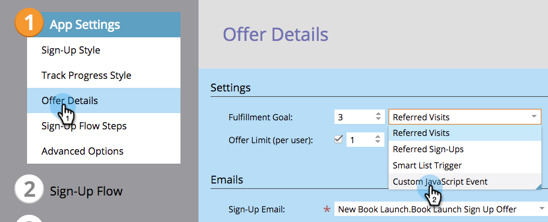

# 사용자 지정 이벤트 {#conversion-script-for-custom-events} 변환 스크립트

참조 오퍼를 생성할 때 이행 목표를 정의합니다. 목표를 향해 카운트하는 동작이 웹 페이지의 특정 이벤트인 경우 전환 스크립트를 사용하여 JavaScript API를 호출할 수 있습니다.

## 전환 스크립트 검색 {#retrieve-the-conversion-script}

1. 참조 오퍼 편집기 내에서 **오퍼 세부 사항**&#x200B;을 클릭한 다음 주문 처리 목표 드롭다운에서 **고객 JavaScript 이벤트**&#x200B;를 선택합니다.

   

1. 회색 상자에 있는 상단 스크립트를 복사하고 `<body>` 태그 내의 웹 페이지에 배치합니다. 아래쪽 스크립트는 `<header>` 태그 내에 배치됩니다.

   

   >[!NOTE]
   >
   >**미리 알림**
   >
   >
   >Marketing이 아닌 웹 사이트에서 작업하는 경우 두 스크립트를 복사하고 붙여넣어야 합니다.

## 로더 스크립트 검색 {#retrieve-the-loader-script}

1. 트리에서 참조 오퍼를 선택한 다음 **참조 오퍼 작업** 및 **포함 코드**&#x200B;를 클릭합니다.

   

1. **헤더 코드**&#x200B;를 마우스 오른쪽 단추로 클릭하고 웹 페이지 헤더에 삽입합니다. 그런 다음 **본문 코드**&#x200B;에도 동일하게 하십시오.

   

## 웹 페이지에 스크립트 붙여넣기 {#pasting-the-scripts-onto-your-webpage}

전환 스크립트를 본문 및 머리글의 HTML에 붙여넣습니다. 다음으로 본문 및 헤더의 HTML에 로더 스크립트를 배치합니다.

## 전환 스크립트 연결 중 {#connecting-the-conversion-script}

다음은 목표 완료를 트리거하려는 페이지 요소의 특정 HTML ID를 사용하는 JavaScript 함수를 작성하는 곳입니다. 예:

`<pre><em><!-- Referral offer conversion script --></em> </pre>` `<pre>`

이 예에서는 ID가 &quot;#myButtonId&quot;인 단추가 웹 페이지에 있습니다. 이 단추를 클릭하면 목표를 완료한 것으로 등록됩니다.

굉장해! 이제 웹 사이트에서 Marketing To를 사용하여 사용자 지정 소셜 홍보 목표를 캡처하고 있습니다.

>[!MORELIKETHIS]
>
>* [참조 오퍼에 대한 목표 지정](../../../../product-docs/demand-generation/social/referral-offers/specify-goal-for-referral-offer.md)
>* [참조 오퍼 만들기](../../../../product-docs/demand-generation/social/referral-offers/create-a-referral-offer.md)
>* [웹 사이트에 Social 배포](deploy-social-on-your-website.md)

