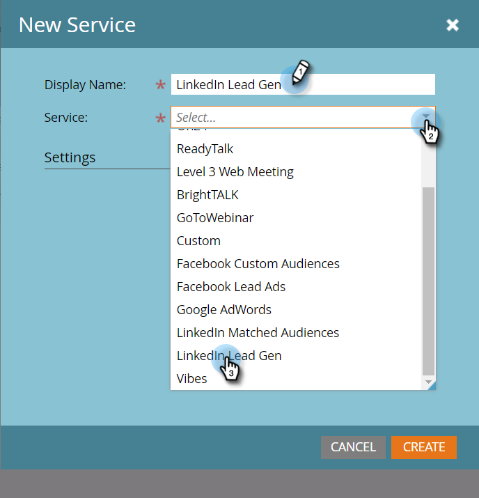
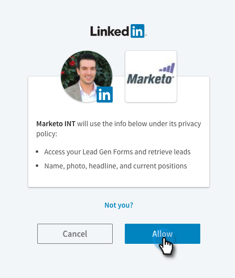

# LinkedIn 리드 생성 양식 설정 {#set-up-linkedin-lead-gen-forms}

LinkedIn 리드 세대 Forms을 사용하여 LinkedIn에서 광고 캠페인을 실행하고 Marketo에 대한 리드를 생성합니다.

>[!IMPORTANT]
>
>LinkedIn이 Marketo Engage LinkedIn 통합에서 사용하는 마케팅 API를 업그레이드하고 있습니다. 이러한 변경 사항을 적용하려면 2024년 6월 7일부터 12월 15일 사이에 **관리자** > **LaunchPoint** 메뉴에서 모든 LinkedIn LaunchPoint 서비스를 다시 인증해야 합니다. 자세한 내용은 [마이그레이션 FAQ](https://nation.marketo.com/t5/employee-blogs/linkedin-re-authentication-required/ba-p/347794){target="_blank"}를 참조하십시오.

>[!NOTE]
>
>**관리자 권한 필요**

>[!NOTE]
>
>LinkedIn 리드가 회사 API를 사용하여 만든 회사 레코드와 연결된 Marketo의 기존 사용자 레코드와 일치하고 Marketo 구독이 CRM에 연결되어 있지 않으면 Marketo Engage으로 연결되지 않습니다.

1. **[!UICONTROL Admin]** 영역으로 이동합니다.

   

1. **[!UICONTROL LaunchPoint]**(으)로 이동하여 **[!UICONTROL New]**&#x200B;을(를) 클릭하고 **[!UICONTROL New Service]**&#x200B;을(를) 선택합니다.

   

1. 서비스에 대한 _표시 이름_&#x200B;을(를) 입력하고 드롭다운에서 **[!UICONTROL LinkedIn Lead Gen]** 서비스를 선택한 다음 **[!UICONTROL Next]**&#x200B;을(를) 클릭합니다.

   

1. Marketo은 동일한 브라우저에서 [linkedin.com](https://www.linkedin.com){target="_blank"}에 대한 새 탭을 엽니다. 통합에 사용할 계정을 사용하여 LinkedIn에 로그인합니다.

   >[!NOTE]
   >
   >LinkedIn 계정에는 스폰서 캠페인을 만드는 데 사용할 모든 LinkedIn 비즈니스 계정에 대한 액세스 권한이 필요합니다.

   

1. LinkedIn에 로그인한 후 Marketo으로 돌아가서 **[!UICONTROL Authorize]**&#x200B;을(를) 클릭합니다.

   

1. 메시지가 표시되면 **[!UICONTROL Allow]**&#x200B;을(를) 클릭하여 LinkedIn에 Marketo 앱 설치를 수락합니다.

   

1. 이제 권한이 부여되었음을 알 수 있습니다. **[!UICONTROL Next]**&#x200B;를 클릭합니다.

   

   >[!CAUTION]
   >
   >이 서비스는 승인 후 1년 후에 자동으로 만료됩니다. 다시 액세스하려면 **[!UICONTROL Re-Authorize]**&#x200B;을(를) 클릭하면 됩니다. 브라우저 설정에 따라 LinkedIn 암호를 다시 입력해야 할 수 있습니다.

1. LinkedIn 리드 세대 잠재 고객이 Marketo으로 이동할 계정을 선택하고 **[!UICONTROL Next]**&#x200B;을(를) 클릭합니다.

   >[!TIP]
   >
   >예상한 비즈니스 계정이 표시되지 않으면 권한이 부여된 사용자의 LinkedIn 계정에 LinkedIn의 비즈니스 계정에 대한 Lead Gen Form Manager 권한이 있는지 확인하십시오.

   

1. 기본 LinkedIn을 Marketo 필드 매핑에 허용하려면 **[!UICONTROL Create]**&#x200B;을(를) 클릭하면 됩니다. 기본 필드 매핑을 변경하거나, 필드 매핑을 제거하거나, 새 필드 매핑을 추가하려면 아래 모달을 통해 필드별로 수행할 수 있습니다.

   >[!CAUTION]
   >
   >Marketo에서는 두 개의 LinkedIn 필드를 단일 Marketo 필드 _에 매핑할 수 있지만_&#x200B;이(가) 두 LinkedIn 필드가 같은 양식에 있지 않은 경우에만 가능합니다. 동일한 LinkedIn 양식의 두 필드를 단일 Marketo 필드에 매핑하면 사람들이 Marketo 데이터베이스를 입력하지 못할 수 있습니다.

   

   >[!NOTE]
   >
   >LinkedIn Campaign Manager의 [양식 서식 파일](https://www.linkedin.com/help/lms/answer/79634){target="_blank"}에 이미 저장된 LinkedIn 필드만 Marketo 필드에 매핑할 수 있는 LinkedIn 필드로 표시됩니다.

   

잘했어! LinkedIn 리드 세대 양식을 제출하는 사람은 LinkedIn 쪽에서 성공적인 캠페인을 실행할 때 Marketo으로 유입되기 시작합니다.

>[!NOTE]
>
>단일 LinkedIn 사용자 계정만 승인할 수 있습니다. Marketo에 연결할 비즈니스 계정이 여러 개 있는 경우 권한이 부여된 사용자의 LinkedIn 계정에 LinkedIn의 비즈니스 계정에 대한 Lead Gen Form Manager 권한이 있는지 확인하십시오.

>[!MORELIKETHIS]
>
>[스마트 캠페인에서 LinkedIn 리드 세대 양식 필터 및 트리거 사용](/help/marketo/product-docs/demand-generation/social/social-functions/use-linkedin-lead-gen-form-filters-and-triggers-in-a-smart-campaign.md){target="_blank"}
