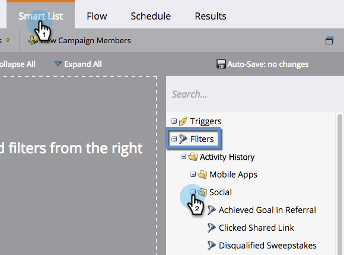

# 소셜 활동에 대한 트리거 및 필터 {#triggers-and-filters-for-social-activities}

Marketing의 소셜 앱에는 고유한 특수 트리거와 필터가 있습니다.

>[!NOTE]
>
>**가용성**
>
>모든 고객이 이 기능을 구입하지는 않았습니다. 자세한 내용은 영업 담당자에게 문의하십시오.

1. 소셜 *트리거를*&#x200B;사용하려면 스마트 캠페인을 선택하고 **스마트 목록** 탭을 클릭합니다. 오른쪽에서 +를 클릭하여 트리거 **를 확장한 다음****Social을**&#x200B;클릭합니다.

   

1. 소셜 *필터*&#x200B;를 사용하려면 **+를** 클릭하여 **필터를**&#x200B;확장합니다.

   

1. 각 소셜 앱에서 작동하는 트리거 및 필터를 보려면 아래 표를 참조하십시오.

   | 트리거/필터 | 소셜 단추 | 투표 | 비디오 | 참조 오퍼 | 경품 행사 |
   |---|---|---|---|---|---|
   | 참조 시 달성된 목표 |  |  |  |  |  |
   | 콘텐츠 공유 |  |  |  |  |  |
   | 공유 링크 클릭 |  |  |  |  |  |
   | 경품 행사 할인 |  |  |  |  |  |
   | 소셜 앱에서 참가 |  |  |  |  |  |
   | 경품 행사 참가 |  |  |  |  |  |
   | 소셜 앱 참조 |  |  |  |  |  |
   | 참조 오퍼에 등록 |  |  |  |  |  |
   | 투표 |  |  |  |  |  |
   | 경품 행사 수상 |  |  |  |  |  |

   >[!NOTE]
   >
   >**관련 문서**
   >
   >* [소셜 성능 보기](view-social-performance.md)

