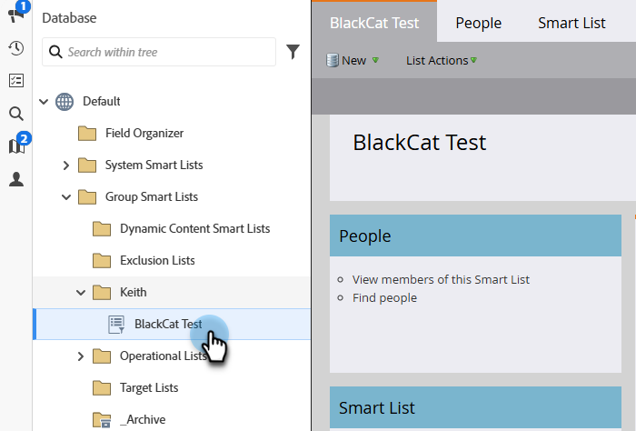

# Marketo 목록 또는 스마트 목록을 LinkedIn 대상자 세그먼트로 사용 {#use-a-marketo-list-or-smart-list-as-a-linkedin-audience-segment}

Marketo Engage 사용자와 LinkedIn 대상을 통합합니다.

>[!PREREQUISITES]
>
>[일치하는 LinkedIn 대상을 LaunchPoint 서비스로 추가](/help/marketo/product-docs/demand-generation/ad-network-integrations/add-linkedin-matched-audiences-as-a-launchpoint-service.md){target="_blank"}

1. **[!UICONTROL Database]**(으)로 이동합니다.

   

1. 스마트 목록을 선택합니다.

   

1. **[!UICONTROL People]** 탭을 클릭합니다.

   

1. 목록의 맨 아래에 있는 **[!UICONTROL Send Via Ad Bridge]** 아이콘 을(를) 클릭합니다.

   

   >[!NOTE]
   >
   >광고 네트워크 통합을 사용하여 LinkedIn에 대상을 보낼 때 Marketo은 이메일 주소만 전송합니다.

1. **[!UICONTROL LinkedIn]**&#x200B;으로 선택하고 **[!UICONTROL Next]**&#x200B;를 클릭합니다.

   

1. **[!UICONTROL LinkedIn Audience]** 선택.

   >[!NOTE]
   >
   >**[!UICONTROL +New Audience]**&#x200B;을(를) 클릭하면 LinkedIn Campaign Manager에 대상이 만들어집니다.

   

   >[!NOTE]
   >
   >LinkedIn은 2018년 3월 &quot;대상자 지우기 및 리드 추가&quot; 푸시 유형에 사용되는 API를 더 이상 사용하지 않습니다. 이 옵션은 Marketo의 2018년 1분기 릴리스부터 더 이상 사용할 수 없습니다.

1. **[!UICONTROL Push Type]** 선택. **[!UICONTROL Update]**&#x200B;를 클릭합니다.

   

   >[!NOTE]
   >
   >15분 동안 동기화가 완료될 수 있도록 허용합니다.

이제 데이터가 LinkedIn 대상자와 동기화됩니다. 계정 및 연락처 타겟팅을 위해 LinkedIn에 목록을 업로드하는 방법에 대한 자세한 내용은 [LinkedIn의 마케팅 솔루션 도움말 센터](https://www.linkedin.com/help/lms/answer/73938?query=ad%20segment){target="_blank"}를 참조하십시오.
