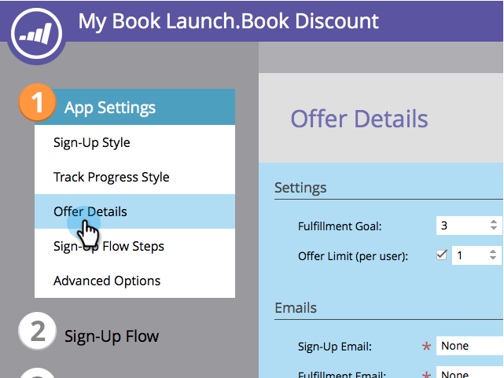

# 오퍼 이행을 위한 프로모션 코드 사용 {#use-promo-codes-for-offer-fulfillment}

참조 오퍼나 경품 이벤트를 만들 때 각 우승자에게 프로모션(쿠폰) 코드를 보낼 수 있습니다. 보상을 받으려면 사이트에서 구매의 체크아웃 페이지와 같은 코드를 사용합니다.

## 프로모션 코드 업로드 {#upload-promo-codes}

1. 마케팅 활동 **으로 이동합니다**.

   

1. 참조 오퍼를 선택하고 초안 **편집을 클릭합니다**.

   

1. 참조 오퍼 편집기에서 **앱 설정** , 오퍼 **세부 정보로 이동합니다.**

   

1. 이메일에서 **판촉**&#x200B;코드 사용을 선택하고 코드 업로드에서 **찾아보기를** 클릭하여 시스템에서 프로모션 코드 파일을 선택합니다.

   

1. 프로모션 코드 파일은 행당 하나의 코드와 .txt 파일 확장명을 갖는 일반 ASCII 텍스트 파일이어야 합니다. 예:

   

   >[!CAUTION]
   >
   >
   >프로모션 코드 파일의 모든 공백은 해당 줄의 코드의 일부로 처리됩니다. 각 줄 끝에 후행 공백이 생기지 않도록 특히 주의하십시오.

1. 업로드가 완료되면 업로드된 코드의 총 수가 표시됩니다.

   

## 전송된 프로모션 코드 검토 {#review-sent-promo-codes}

참가자가 할인 혜택을 받기 시작하면 누구에게 언제 보낸 프로모션 코드를 확인할 수 있습니다.

>[!NOTE]
>
>액세스 권한이 있는 Marketing *To 사용자만* 이 정보에 액세스할 수 있습니다. 사용자 [역할 및 권한 관리를 참조하십시오](../../../../product-docs/administration/users-and-roles/managing-user-roles-and-permissions.md).

1. 마케팅 활동 **으로 이동합니다**.

   

1. 참조 오퍼 또는 경품 이벤트를 선택하고 **참가자 탭을** 클릭합니다.

   

1. 여기 응모가 몇 개 있습니다 프로모션 코드 **열에서** 숫자를 클릭하여 해당 참가자에게 전송된 프로모션 코드와 시간을 확인합니다.

   
