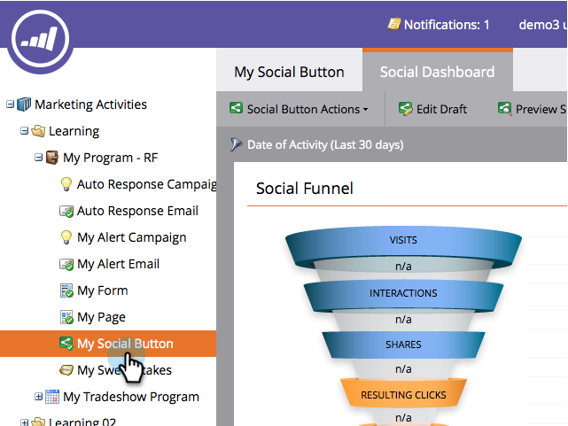
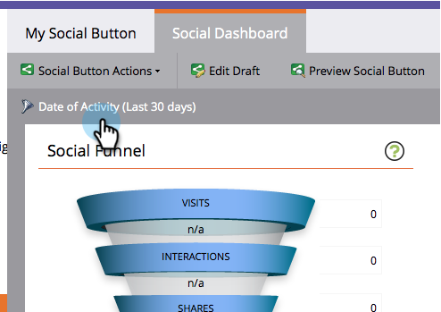

# 소셜 성능 보기 {#view-social-performance}

소셜 앱에서 생성된 소셜 활동을 참조하십시오. 소셜 대시보드는 소셜 앱에서 생성되는 다양한 소셜 상호 작용에 대한 통찰력을 제공하며 소셜 앱의 성과를 추적할 수 있도록 해줍니다.

>[!AVAILABILITY]
>
>모든 고객이 이 기능을 구입하지는 않았습니다. 자세한 내용은 영업 담당자에게 문의하십시오.

1. **마케팅 활동**&#x200B;으로 이동합니다.

   

1. 소셜 앱을 선택합니다.

   

1. **활동 날짜**&#x200B;를 클릭합니다.

   

1. 시간 간격을 선택합니다.

   

   >[!NOTE]
   >
   >**지난 24시간**&#x200B;을 선택하는 경우 지표는 시간 상단에서 시간별로 계산됩니다. 다른 모든 간격에 대해 지표는 전날 자정에 매일 실행됩니다.

1. **소셜 단계**&#x200B;를 사용하여 프로모션의 소셜 진행 및 효과를 검토합니다.

   * **캠페인 방문**:잠재 고객이 소셜 앱이 포함된 페이지를 로드하는 횟수입니다.
   * **상호 작용**:잠재 고객이  [추천 제안](/help/marketo/product-docs/demand-generation/social/referral-offers/create-a-referral-offer.md) 가입, 투표 , 비디오  공유 등 소셜앱과 상호 작용한 횟수입니다.
   * **공유**:잠재 고객이 소셜 앱에서 소셜 네트워크에 메시지를 공유하는 횟수입니다.
   * **결과 클릭** 수:잠재 고객이 소셜 앱의 공유 링크를 클릭한 횟수입니다.
   * **등록**:앱으로의 공유 링크를 다시 팔로우한 후 프로모션에 등록한 잠재 고객 수입니다.

   >[!NOTE]
   >
   >여러 소셜 앱이 있는 페이지에 대한 방문은 각각 한 번의 방문으로 카운트됩니다. 동일한 앱 내에서 여러 페이지에 대한 방문은 하나의 방문으로 계산됩니다. 30분 이상 경과한 방문 또는 브라우저를 다시 시작한 방문은 새로 계산됩니다.

   

1. **Audience** 패널을 사용하여 잠재 고객이 단어를 찾는 데 어떻게 도움이 되는지 검토할 수 있습니다.

   * **총 프로필** 수:소셜 앱에서 소셜 네트워크에 로그인한 전체 잠재 고객 수입니다.
   * **영향력 행사자**:앱 공유에서 클릭으로 인해 하나 이상의 클릭을 생성한 잠재 고객 수입니다.
   * **소셜 도달**:모든 잠재 고객의 연결 합계입니다. 소셜 네트워크에 공유하는 잠재 고객의 경우 소셜 앱에서 공유하던 친구의 수입니다. 이메일 공유의 경우 앱에서 생성된 이메일의 수신자 수입니다.
   * **소셜 노출 횟수**:소셜 앱이 잠재 고객의 연결 피드에 나타나는 총 횟수입니다.

   

1. **지표 공유** 패널을 사용하여 소셜 앱에서 생성된 집계된 소셜 활동을 검토합니다.

   * **공유율**:공유를 생성하는 앱 방문 횟수의 백분율입니다.
   * **클릭백 비율**:공유당 결과 클릭 수.
   * **소셜 향상도**:소셜 앱이 아닌 다른 소스에서 나온 비소셜 방문 횟수에 대한 앱 방문 비율(공유 링크를 통해 제공).

   

>[!MORELIKETHIS]
>
>또한 트리거 및 필터를 사용하여 컨텐츠를 공유하고 소셜 앱과의 상호 작용을 확인하여 이러한 상호 작용에 대응할 수 있습니다. [소셜 활동에 대한 트리거 및 필터 사용](/help/marketo/product-docs/demand-generation/social/social-functions/triggers-and-filters-for-social-activities.md)을 참조하십시오.
