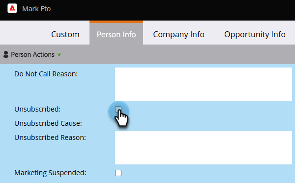

# 지속적인 구독 취소 {#durable-unsubscribe}

Marketo은 &quot;지속적&quot;으로 만들기 위해 구독 취소 기능의 비헤이비어를 개선했습니다. 개인 세부 정보 레코드에 표시되는 구독 취소 플래그와 별도의 마스터 이메일 상태를 추가했습니다.

구독 취소 플래그가 false에서 true로 설정되면 마스터 이메일 상태가 업데이트되고 변경 사항이 동일한 이메일 주소를 가진 다른 사용자에게 전파됩니다. 사용자를 제거하고 다시 만드는 경우 또는 동일한 전자 메일 주소로 새 레코드를 만드는 경우 구독 취소 플래그를 **덮어쓰지**&#x200B;합니다.

>[!NOTE]
>
>지속 구독 취소는 전체 Marketo 데이터베이스의 모든 파티션에서 작동합니다.

## 구독 취소 플래그를 True에서 False로 업데이트(예: 개인 다시 구독) {#update-the-unsubscribe-flag-from-true-to-false-e-g-re-subscribe-a-person}

개인이 다시 구독할 수 있는 방법에는 여러 가지가 있습니다.

Salesforce에서 잠재 고객/연락처 기록의 이메일 옵트아웃 필드를 지웁니다. Marketo과 동기화됩니다.

Marketo에서 개인 레코드의 정보 탭에서 구독 취소 상자를 지웁니다.

한 명 이상의 사용자에 대해 아래와 같이 _데이터 값 변경_ 흐름 단계를 실행하십시오.

## 새 사용자 만들기 {#creating-a-new-person}

새 사용자가 생성되면 Marketo은 마스터 이메일 상태 테이블에 대해 확인합니다. 이전에 구독을 취소한 경우 구독 취소 레코드가 업데이트됩니다.

## 이메일 주소 변경 {#changing-an-email-address}

개인의 이메일 주소를 구독 취소 이메일 주소로 변경하면 해당 개인의 구독이 취소됩니다. 이 변경 사항은 Marketo 또는 [!DNL Salesforce]에서 발생할 수 있습니다.

## 다시 구독 {#re-subscribing}

구독을 취소하면 동일한 이메일 주소를 가진 모든 사람이 구독 취소되는 것처럼, 재구독은 실제로 동일한 이메일 주소를 가진 모든 사람을 다시 구독합니다.

>[!MORELIKETHIS]
>
>[구독 취소 이해](/help/marketo/product-docs/email-marketing/deliverability/understanding-unsubscribe.md)
