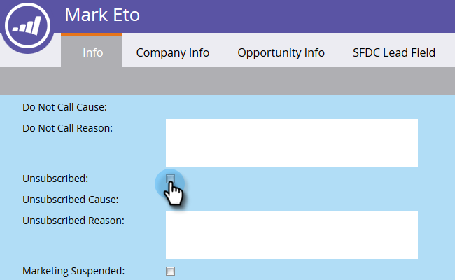

# 지속적인 구독 취소 {#durable-unsubscribe}

Marketing에서는 구독 취소 기능의 동작을 &quot;내구성&quot;으로 개선했습니다. 개인 세부 정보 레코드에 표시되는 구독 취소 플래그와 별개인 마스터 이메일 상태가 추가되었습니다.

가입 해지 플래그가 false에서 true로 설정되어 있으면 마스터 이메일 상태가 업데이트되고 변경 사항이 동일한 이메일 주소를 사용하는 다른 사람에게 전파됩니다. 한 사람이 제거되고 다시 작성되거나, 동일한 이메일 주소로 새 레코드가 만들어진 경우, 구독 취소 플래그는 **이(가) 아닌**&#x200B;을(를) 덮어씁니다.

>[!NOTE]
>
>지속적인 가입 해지는 전체 Marketing To 데이터베이스의 모든 파티션에서 작동합니다.

## 가입 해제 플래그를 True에서 False로 업데이트(예: 사람 재가입) {#update-the-unsubscribe-flag-from-true-to-false-e-g-re-subscribe-a-person}

한 사람이 다시 구독할 수 있는 몇 가지 방법이 있다.

Salesforce에서 **리드/연락처 레코드의 이메일 옵트아웃 필드를 지웁니다.** Marketing To와 동기화됩니다.

Marketing To에서, **개인 레코드의 정보 탭에 있는 가입되지 않은 상자를 지웁니다.**.

하나 이상의 사람에 대해 아래와 같이 **데이터 값 변경** 흐름 단계를 실행합니다.

SOAP API를 통해 기존 사람을 업데이트합니다.

## 새 사람 만들기 {#creating-a-new-person}

새 사람을 만들면 Marketing에서 마스터 이메일 상태 테이블에 대해 확인합니다. 이전에 구독을 취소한 경우 구독을 취소할 레코드를 업데이트합니다.

## 이메일 주소 {#changing-an-email-address} 변경

사용자의 이메일 주소를 구독 취소된 이메일 주소로 변경하면 해당 사람도 가입이 취소됩니다. 이러한 변경은 Marketing To 또는 Salesforce에서 발생할 수 있습니다.

가입되지 않은 이메일 주소를 가입된 이메일 주소로 변경하면 해당 사람도 가입하게 됩니다.

## {#re-subscribing} 재구독

구독을 취소하면 동일한 이메일 주소를 사용하는 모든 사용자가 구독을 취소할 수 있는 것처럼 동일한 이메일 주소를 사용하는 모든 사용자가 다시 구독하게 됩니다.

## 활동 로그 {#activity-log}

*updateLeadEmailStatus* 및 *resetLeadEmailStatus*&#x200B;에 대한 데이터 값 변경 정의는 [이 커뮤니티 문서](http://nation.marketo.com/t5/Knowledgebase/Durable-Unsubscribe-Activity-Log/ta-p/252688)에서 찾을 수 있습니다.

>[!MORELIKETHIS]
>
>[가입 해지 이해](understanding-unsubscribe.md)

