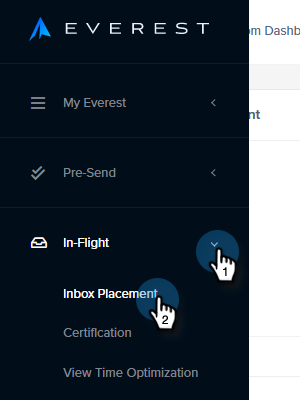

# 전자 메일 게재 기능 팩: 시드 목록을 가져오는 방법 {#email-deliverability-power-pack-how-to-import-a-seed-list}

시드 목록은 Google 앱, Hotmail, Yahoo! 등을 포함하여 여러 사서함 공급자의 이메일 계정 목록이며 받은 편지함 비율과 스팸 폴더 게재 가능성을 대략적으로 계산하는 데 사용됩니다. 다음은 해당 목록을 Marketo 인스턴스로 가져오는 방법입니다.

>[!AVAILABILITY]
>
>모든 고객이 이 기능을 구입한 것은 아닙니다. 자세한 내용은 영업 담당자에게 문의하십시오.

## 시드 목록 가져오기 {#import-a-seed-list}

1. 내 Marketo에서 **게재 기능 도구**.

   

1. 에베레스트 애플리케이션이 열립니다. 왼쪽 탐색 메뉴에서 **비행 중** 을(를) 선택합니다. **받은 편지함 배치**.

   

1. 을(를) 클릭합니다. **시드 목록 관리** 탭.

   

1. 작업 드롭다운을 클릭하고 을 선택합니다 **한 줄에 하나씩 다운로드**.

   

   >[!NOTE]
   >
   >Everest가 목록을 최적화하도록 하려면 페이지 상단에 있는 Seed List Optimizer 를 사용합니다.

1. 내보낸 후에 목록이 브라우저의 다운로드 폴더에 .txt 파일로 표시됩니다. 검색, [가져오기](/help/marketo/getting-started/quick-wins/import-a-list-of-people.md) 정적 목록으로 Marketo 인스턴스에 추가할 수 있습니다.

   

   >[!TIP]
   >
   >쉽게 찾을 수 있도록 목록에 이름을 지정하도록 하십시오.

   >[!CAUTION]
   >
   >월별 이러한 받은 편지함 배치 캠페인의 양이 제한됩니다. 다운로드 수를 보려면 계정 설정 > Everest의 Subscription 섹션을 참조하십시오. 자세한 내용은 Marketo 영업 담당자에게 문의하십시오.

## 새 시드 목록 가져오기 {#acquiring-new-seedlists}

시드 목록은 매월 같은 빈도로 변경될 수 있습니다. 전자 메일 게재 기능 팩에 정기적으로 로그인하여 시드 목록의 상태를 확인하는 것이 중요합니다. 새 주소를 추가하거나 끝에 업데이트가 필요한 경우 애플리케이션 왼쪽 하단에 있는 알림 아이콘을 통해 알림을 받게 됩니다.

Marketo에서 정적 목록을 만든 후 보내기를 시작하여 이메일의 받은 편지함 배치를 테스트할 수 있습니다.
