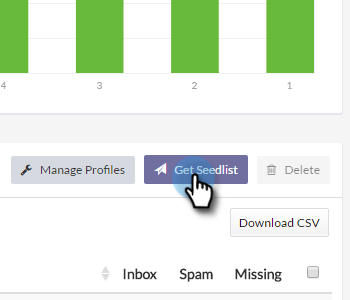

# 이메일 배달 가능 전원 팩:설명 목록 가져오기 방법 {#email-deliverability-power-pack-how-to-import-a-seedlist}

시드 목록은 Google Apps, Hotmail, Yahoo! 등을 비롯한 여러 사서함 공급자의 이메일 계정 목록으로 받은 편지함의 비율과 스팸 폴더 제공 비율을 대략적으로 계산하는 데 사용됩니다. 이 목록을 Marketing To 인스턴스로 가져오는 방법은 다음과 같습니다.

>[!NOTE]
>
>**가용성**
>
>모든 고객이 이 기능을 구입하지는 않았습니다. 자세한 내용은 영업 담당자에게 문의하십시오.

## 설명 목록 가져오기 {#import-a-seedlist}

1. **배달 도구**&#x200B;로 이동합니다.

   

1. **받은 편지함 제보자**&#x200B;를 클릭합니다.

   

1. **Get Seedlist**&#x200B;를 클릭합니다.

   

1. **목록 내보내기**&#x200B;를 클릭합니다.

   

   >[!NOTE]
   >
   >[목록](http://support.250ok.com/hc/en-us/articles/216763528-What-is-the-list-optimizer-and-why-should-I-use-it-)을 최적화하도록 250확인을 하려면 **목록 최적화**&#x200B;를 선택합니다. 포함시킬 묘목 목록 영역을 선택하려면 목록 사용자 지정**을 선택합니다.

1. 내보내면 목록이 브라우저의 다운로드 폴더에 .txt 파일로 표시됩니다. 검색한 다음 [Import](../../../getting-started/quick-wins/import-a-list-of-people.md)를 Marketing 인스턴스로 정적 목록으로 가져옵니다.

   

   >[!TIP]
   >
   >쉽게 찾을 수 있도록 목록의 이름을 지정하십시오.

   >[!CAUTION]
   >
   >매월 이러한 받은 편지함 정보 제공업체 캠페인의 양을 제한합니다. 다운로드 횟수를 확인하려면 250ok **계정 설정**&#x200B;을 확인하십시오. 자세한 내용은 Marketing To Sales Rep 에게 문의하십시오.

## 새 시드 목록 가져오기 {#acquiring-new-seedlists}

여러분의 씨 목록은 매달 자주 바뀔 수 있습니다. 이메일 배달 전원 팩에 정기적으로 로그인하고 시드 목록의 상태를 확인하는 것이 중요합니다. 새 주소가 추가되거나 끝에 업데이트가 필요한 경우 [세부 목록 가져오기] 페이지의 인터페이스를 통해 알림을 받게 됩니다.

Marketing To에서 정적 목록이 만들어지면 해당 목록에 대한 전송을 시작하여 이메일의 받은 편지함 배치를 테스트할 수 있습니다.