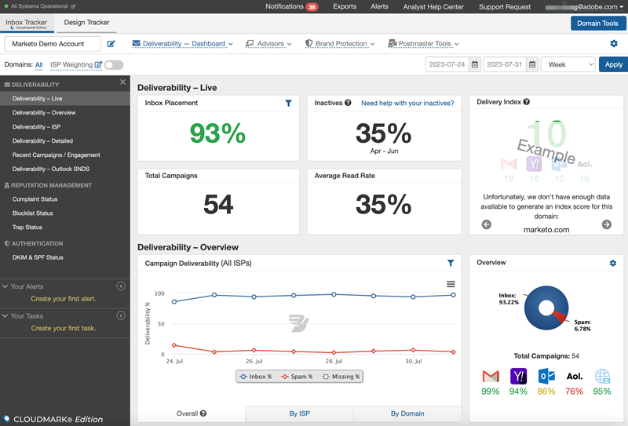
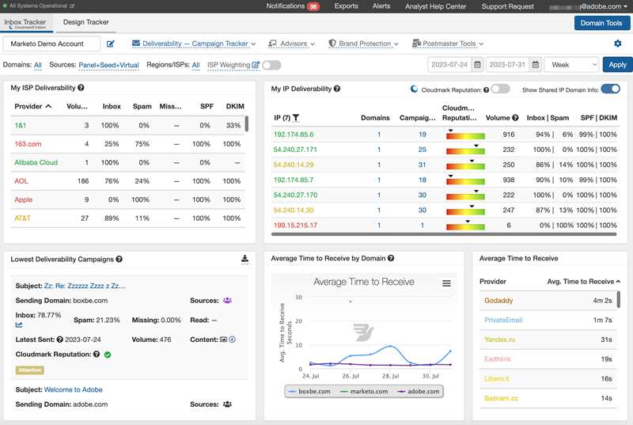
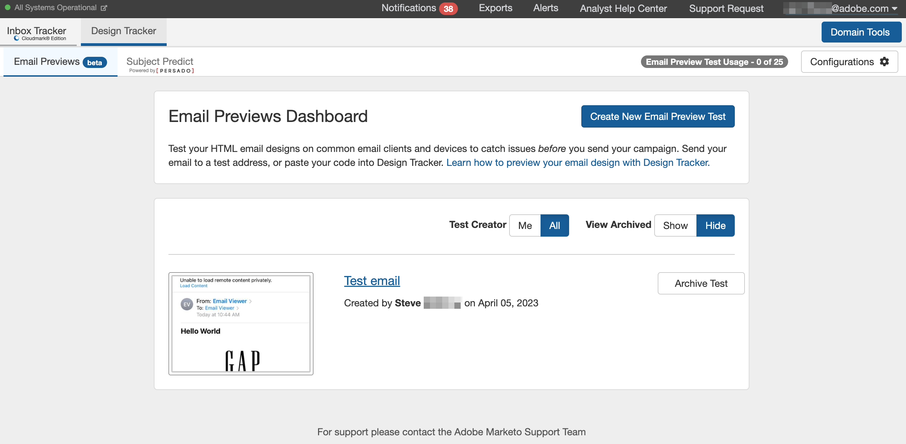

# 받은 편지함 추적기 Tutorials {#inbox-tracker-tutorials.md}

MessageBird의 받은 편지함 추적기 플랫폼에서 제공하는 Marketo의 이메일 게재 기능 Powerpack을 사용하여 게재 기능 문제를 테스트, 모니터링 및 이해합니다. Inbox Tracker는 프로그램의 인텔리전스와 이메일 렌더링/받은 편지함 테스트의 선견지명을 결합하여 이메일 성능을 극대화하는 단일 애플리케이션입니다.

MessageBird는 이 강력한 도구를 최대한 활용하는 데 도움이 되는 몇 가지 교육 비디오를 만들었습니다.

## 받은 편지함 추적기 개요 {#inbox-tracker-overview}

* [기본 탐색](https://veed.io/view/263a0e5e-3b0c-40a4-98a7-945fe28173a1){target="_blank"}

* [사용자 및 계정 설정](https://veed.io/view/dae8007a-89b4-4a2a-b666-0e9b12706866){target="_blank"}

* [Intelliseed(구성 및 다운로드)](https://veed.io/view/8b9e398e-21c9-49dc-a133-e1d8eb8ba03d){target="_blank"}

## 받은 편지함 추적기 게재 기능 섹션 {#inbox-tracker-deliverability-section}

* [대시보드 개요](https://veed.io/view/2d1084f3-b4b4-440b-9977-a3cc3b885bb9){target="_blank"}

* [대시보드(게재 가능성)](https://veed.io/view/f5dc2e22-3ed1-4024-b6c5-bf346adcc07d){target="_blank"}

* [대시보드(신뢰도 및 인증)](https://veed.io/view/ec237f9d-7923-4ddc-8a58-15d58774d382){target="_blank"}

* [ISP 가중치](https://veed.io/view/bec80e1d-66f2-462c-8470-60610c8a07f7){target="_blank"}

* [경고](https://veed.io/view/1d968a33-e565-4cd2-b25f-53cca61b4823){target="_blank"}

* [Campaign 추적기 개요](https://veed.io/view/8c92bdc5-4131-498c-a450-a518f2e91b17){target="_blank"}

* [Campaign 추적기(캠페인 검토)](https://veed.io/view/9c8e18a4-5d9e-495c-ad92-83309f40314a){target="_blank"}

* [분석 추적기](https://veed.io/view/b458f788-07e1-4553-b743-2d469a356ba2){target="_blank"}

* [프로필 모니터](https://veed.io/view/6ca38d3f-df46-4707-a6cb-dde0fbad470b){target="_blank"}

* [스팸 트랩 모니터](https://veed.io/view/ce488da2-1688-4584-9c26-27baa9c8ed19){target="_blank"}

## 받은 편지함 추적기 브랜드 보호 {#inbox-tracker-brand-protection}

* [대시보드](https://veed.io/view/287b425f-2ec8-470b-b993-a654b92b759d){target="_blank"}

* [도메인 세부 사항](https://veed.io/view/cb8a4f53-8008-483b-841a-b0878b8bf17b){target="_blank"}

* [정책 관리자](https://veed.io/view/1036967c-0f77-4fd6-8c40-71553bceef3d){target="_blank"}

## 받은 편지함 추적기 Postmaster 도구 {#inbox-tracker-postmaster-tools}

* [Google Postmaster 도구](https://veed.io/view/7c89c0d8-ead2-46ad-9709-7509d043442a){target="_blank"}

## 디자인 추적기 {#design-tracker}

* [디자인 추적기](https://veed.io/view/3efe7959-d835-4a00-948c-93e4a0394871){target="_blank"}
