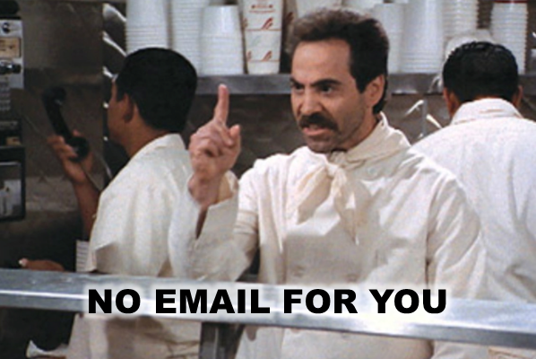

# 구독 취소 이해 {#understanding-unsubscribe}

Marketing Cloud에는 실제로 여러 가지 유형의 내장된 가입 해제가 있습니다. 모두 사람 개체의 필드로 표시됩니다(이름).

>[!NOTE]
>
>Marketing은 Blacklist 및 Whitelist와 같은 용어를 Adobe 제품차단 목록에 추가하다의 및 허용 목록에 추가하다로 변경하는 중입니다. 이 업데이트 중에 UI 및 문서 스크린샷의 이전 용어와 설명서 텍스트의 새 용어를 볼 수 있습니다. 혼동을 사과드립니다.

이러한 모든 필드는 Marketing To 구독에 내장되어 있습니다. 모두 부울(확인란) 유형입니다. Forms 또는 [데이터 값 변경](/help/marketo/product-docs/core-marketo-concepts/smart-campaigns/flow-actions/change-data-value.md) 흐름 단계에서 사용할 수 있습니다.

## 구독 취소 {#unsubscribed}

이것은 표준 구독 취소 페이지에서 사용됩니다. 이 상자를 선택하거나 이메일의 구독 취소 링크를 클릭하는 경우 마케팅 이메일이 더 이상 수신되지 않습니다. 그러나 [운영 이메일](/help/marketo/product-docs/email-marketing/general/functions-in-the-editor/make-an-email-operational.md)을 수신하게 됩니다.

## 마케팅 일시 중단 {#marketing-suspended}

이 필드는 사용자가 임시 가입 해지된 사람을 배치하는 것으로 설정됩니다. 사용자는 수동으로 변경하거나 변경 데이터 값 흐름 단계를 사용하는 경우에만 이 상태를 달성할 수 있습니다.

## 일시 중단된 이메일 {#email-suspended}

이 상태는 하드 바운스가 발생한 후 24시간 동안 mailing을 차단합니다. 24시간 후에, 그 사람은 다시 우편 배달이 될 것이다.

>[!NOTE]
>
>24시간 기간이 끝난 후에도 일시 중단된 이메일은 계속 확인되므로 이전에 이렇게 표시된 사람을 참조할 수 있습니다. 이메일을 보낼 수 있는지 확인하려면 이메일 일시 중단 발생 후 24시간을 계산하면 됩니다.

## 차단 목록에 추가된 {#blocklisted}

[경쟁](/help/marketo/product-docs/core-marketo-concepts/smart-lists-and-static-lists/managing-people-in-smart-lists/add-person-to-blocklist.md) 업체와 유사한 사용자에게 적합합니다. **no** 이메일—운영, 마케팅 등을 받으려는 사람 그들은 아무것도 얻지 못해!

