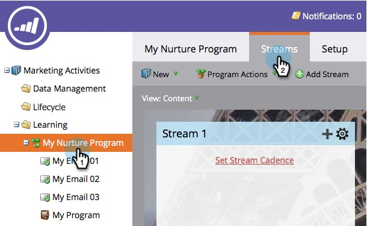
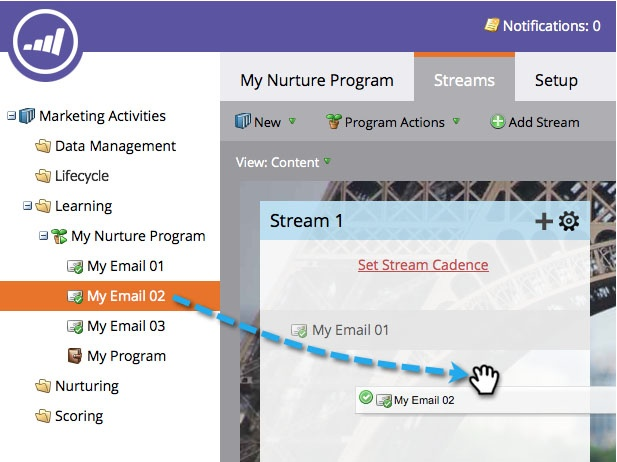

# 스트림에 컨텐츠 추가 {#add-content-to-a-stream}

참여 프로그램을 만들었으면 콘텐츠를 스트림에 추가해야 합니다. 스트림에 이메일 또는 프로그램을 추가할 수 있습니다.

## 스트림에 이메일 추가 {#add-an-email-to-a-stream}

1. 마케팅 활동 **으로 이동합니다**.

   

1. 참여 프로그램을 선택하고 스트림 **탭으로** 이동합니다.

   

   첫 번째 이메일을 세 가지 방법으로 추가할 수 있습니다.

**콘텐츠 추가 단추**

1. [콘텐트 **추가] 단추를** 클릭합니다.

   

1. [ **유형** ]을 [ **이메일]으로**&#x200B;설정한 다음 추가할 이메일을 선택합니다.

   

   >[!TIP]
   >
   >이 참여 프로그램에 로컬로 설정된 이메일이 맨 위에 정렬됩니다.

**스트림 + 아이콘**

1. 스트림 **+** 아이콘을 클릭하고, **유형을** 이메일로 ****&#x200B;두고추가할 이메일을 선택합니다.

   

**드래그 앤 드롭**

1. 트리의 이메일을 스트림으로 드래그하면 됩니다.

   

## 스트림에 프로그램 추가 {#add-a-program-to-a-stream}

1. 마케팅 활동 **으로 이동합니다**.

   

1. 참여 프로그램을 선택하고 스트림 **탭으로** 이동합니다.

   

   다음 세 가지 방법으로 스트림에 프로그램을 추가할 수 있습니다.

**콘텐츠 추가 단추**

1. 콘텐츠 **추가를 클릭합니다**.

   

1. 유형을 **프로그램으로** 변경합니다.

   

1. 프로그램을 찾아 선택합니다.

   

1. 이제 사람들이 실행되기를 원하는 프로그램에서 스마트한 캠페인을 선택할 수 있습니다.

   

   >[!NOTE]
   >
   >**미리 알림**
   >
   >
   >이 기능이 제대로 작동하도록 스마트 캠페인에 참여 프로그램 **구성원** 필터가 있어야 합니다.

**스트림 + 아이콘**

1. 스트림 **+** 아이콘을 클릭한 다음 유형 **을** 프로그램으로 변경합니다.

   

1. 프로그램을 찾아 선택합니다.

   

1. 사람을 처리할 스마트 캠페인을 선택합니다.

   

**드래그 앤 드롭**

1. 트리에서 원하는 프로그램을 스트림으로 드래그하여 놓습니다.

   

1. 이제 사람들이 원하는 스마트한 캠페인을 선택하기만 하면 됩니다.

   

잘했어! 이제 프로그램 스트림에 컨텐츠를 추가하는 다양한 방법을 알고 있습니다. 양육에 필요한 만큼 추가하세요. 자세한 내용은 아래 관련 문서를 참조하십시오.

>[!NOTE]
>
>**관련 문서**
>
>* [참여 프로그램 스트림에 프로그램 추가](adding-a-program-to-an-engagement-program-stream.md)

>

