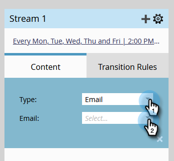
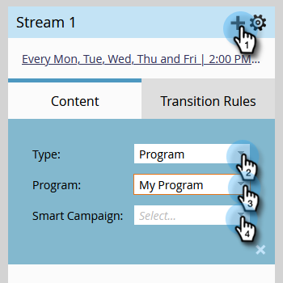

# 스트림에 콘텐츠 추가 {#add-content-to-a-stream}

참여 프로그램을 만든 후에는 스트림에 콘텐츠를 추가해야 합니다. 스트림에 전자 메일 또는 프로그램을 추가할 수 있습니다.

1. **[!UICONTROL Marketing Activities]** 으로 이동합니다.

   

1. 참여 프로그램을 선택하고 **[!UICONTROL Streams]** 탭으로 이동합니다.

   

   다음 두 가지 방법으로 컨텐츠를 추가할 수 있습니다.

**콘텐츠 추가 단추**

1. **[!UICONTROL Add Content]** 단추를 클릭합니다.

   

1. **[!UICONTROL Email]** _또는_ **[!UICONTROL Program]**&#x200B;을(를) 선택한 다음 추가할 전자 메일 또는 프로그램/스마트 캠페인을 선택하십시오.

   

   >[!TIP]
   >
   >이 참여 프로그램의 로컬 이메일이 맨 위에 정렬됩니다.

**+ 아이콘**

1. **+** 아이콘을 클릭하고 **[!UICONTROL Email]** _또는_ **[!UICONTROL Program]**&#x200B;을(를) 선택한 다음 추가할 전자 메일 또는 프로그램/스마트 캠페인을 선택하십시오.

   

   >[!NOTE]
   >
   >스마트 캠페인이 제대로 작동하려면 **[!UICONTROL Member of Engagement Program]** 필터가 있어야 합니다.

>[!MORELIKETHIS]
>
>[참여 프로그램 스트림에 프로그램 추가](/help/marketo/product-docs/email-marketing/drip-nurturing/creating-an-engagement-program/adding-a-program-to-an-engagement-program-stream.md)
