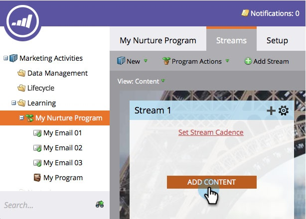
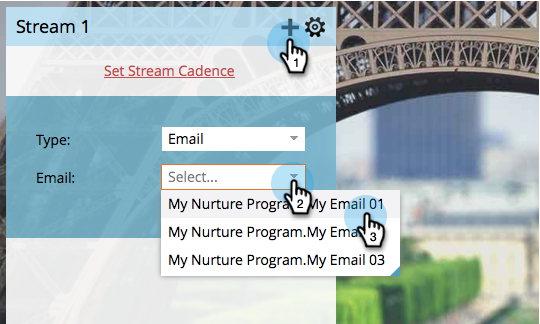

# 스트림 {#add-content-to-a-stream}에 컨텐츠 추가

참여 프로그램을 만들었으면 콘텐츠를 스트림에 추가해야 합니다. 스트림에 이메일 또는 프로그램을 추가할 수 있습니다.

## 스트림 {#add-an-email-to-a-stream}에 이메일 추가

1. **마케팅 활동**&#x200B;으로 이동합니다.

   

1. 참여 프로그램을 선택하고 **Streams** 탭으로 이동합니다.

   

   다음과 같이 세 가지 방법으로 첫 번째 이메일을 추가할 수 있습니다.

**콘텐츠 추가 단추**

1. **콘텐츠 추가** 단추를 클릭합니다.

   

1. **Type**&#x200B;을 **이메일**&#x200B;으로 설정한 다음 추가할 이메일을 선택합니다.

   

   >[!TIP]
   >
   >이 참여 프로그램에 대한 로컬 이메일이 맨 위에 정렬됩니다.

**스트림 + 아이콘**

1. 스트림 **+** 아이콘을 클릭하고 **유형**&#x200B;을 **이메일**&#x200B;으로 남겨 두고 추가할 이메일을 선택합니다.

   

**드래그 앤 드롭**

1. 트리의 이메일을 스트림으로 드래그하면 됩니다.

   

## 스트림 {#add-a-program-to-a-stream}에 프로그램 추가

1. **마케팅 활동**&#x200B;으로 이동합니다.

   

1. 참여 프로그램을 선택하고 **Streams** 탭으로 이동합니다.

   

   다음 3가지 방법으로 스트림에 프로그램을 추가할 수 있습니다.

**콘텐츠 추가 단추**

1. **콘텐츠 추가**&#x200B;를 클릭합니다.

   

1. **Type**&#x200B;을 Program으로 변경합니다.

   

1. 프로그램을 찾아 선택합니다.

   

1. 이제 사람들이 실행하기를 원하는 프로그램에서 스마트한 캠페인을 선택합니다.

   

   >[!NOTE]
   >
   >이 작업이 제대로 작동하려면 스마트 캠페인에 **참여 프로그램 구성원 필터가 있어야 합니다.**

**스트림 + 아이콘**

1. 스트림 **+** 아이콘을 클릭한 다음 **유형**&#x200B;을 프로그램으로 변경합니다.

   

1. 프로그램을 찾아 선택합니다.

   

1. 사람을 처리할 스마트한 캠페인을 선택합니다.

   

**드래그 앤 드롭**

1. 트리에서 원하는 프로그램을 스트림으로 드래그하여 놓습니다.

   

1. 이제 사람들이 경험하기를 원하는 스마트한 캠페인을 선택하기만 하면 됩니다.

   

잘했어요! 이제 프로그램 스트림에 컨텐츠를 추가하는 다양한 방법을 알 수 있습니다. 양육에 필요한 만큼 추가하세요. 자세한 내용은 아래 관련 문서를 참조하십시오.

>[!MORELIKETHIS]
>
>[참여 프로그램 스트림에 프로그램 추가](/help/marketo/product-docs/email-marketing/drip-nurturing/creating-an-engagement-program/adding-a-program-to-an-engagement-program-stream.md)
