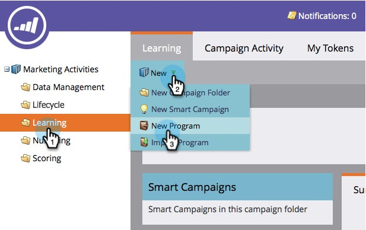

# 참여 프로그램 만들기 {#create-an-engagement-program}

Marketing의 참여 프로그램을 사용하여 이메일 개발을 손쉽게 수행할 수 있습니다.

1. **마케팅 활동**&#x200B;으로 이동합니다.
1. 

1. 참여 프로그램을 만들 폴더를 선택한 다음 **새로 만들기** 및 **새 프로그램**&#x200B;을 클릭합니다.
1. 

1. **이름**&#x200B;을 입력하고 **프로그램 유형**&#x200B;에 **참여**&#x200B;를 선택하고 **만들기**&#x200B;를 클릭합니다.
1. 

1. 자, 이제 약혼 프로그램이 있으니 앞으로 나아가서 옷으로 입읍시다.
1. 

1. 교육 캠페인 만들기 및 실행에 대한 비디오 보기
   `<iframe width="630" height="470" src="//play.vidyard.com/ZMzANBfrz2vBKnajiDeDQs.html?v=3.1.1" frameborder="0" allowfullscreen></iframe>`

   >[!NOTE]
   >
   >**관련 문서**
   >
   >    
   >    
   >    * [스트림에 컨텐츠 추가](add-content-to-a-stream.md)
   >    * [스트림 대상 설정](../../../../product-docs/email-marketing/drip-nurturing/engagement-program-streams/set-stream-cadence.md)

