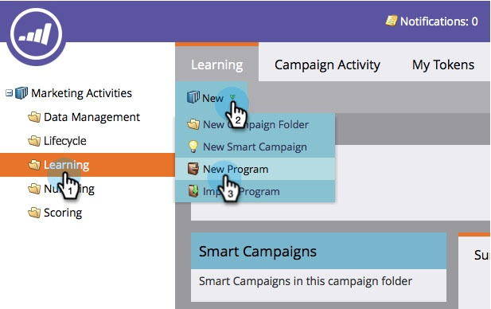
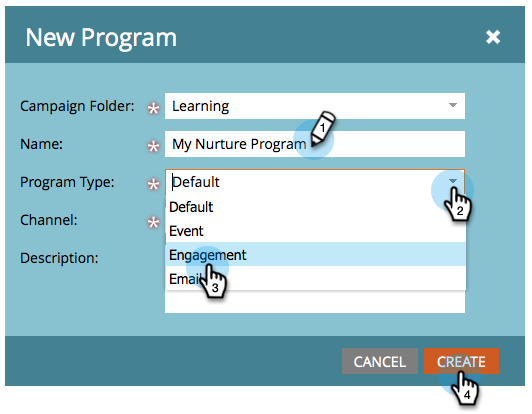

# 참여 프로그램 만들기 {#create-an-engagement-program}

Marketo의 참여 프로그램을 사용하여 간편하게 이메일 지원을 수행할 수 있습니다.

1. **[!UICONTROL Marketing Activities]** 으로 이동합니다.

   

1. 참여 프로그램을 만들 폴더를 선택한 다음 **[!UICONTROL New]** 및 **[!UICONTROL New Program]**&#x200B;을 클릭합니다.

   

1. **[!UICONTROL Name]**&#x200B;을 입력하고, **[!UICONTROL Engagement]**&#x200B;를 **[!UICONTROL Program Type]**&#x200B;으로 선택한 후 **[!UICONTROL Create]**&#x200B;를 클릭합니다.

   

1. 이제 참여 프로그램을 갖게 되었으니 다음 단계로 가보겠습니다.

   

   >[!MORELIKETHIS]
   >
   >* [스트림에 콘텐츠 추가](/help/marketo/product-docs/email-marketing/drip-nurturing/creating-an-engagement-program/add-content-to-a-stream.md)
   >* [스트림 케이던스 설정](/help/marketo/product-docs/email-marketing/drip-nurturing/engagement-program-streams/set-stream-cadence.md)
