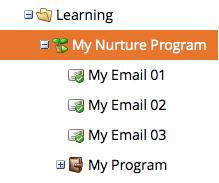

# 참여 프로그램 이해 {#understanding-engagement-programs}

참여 프로그램은 컨텐츠를 체계적으로 제공하여 신규 고객을 대상으로 마케팅하도록 설계되었습니다.

>[!NOTE]
>
>가입당 활성 **활성** 참여 프로그램은 100개로 제한됩니다.

## 참여 프로그램 {#engagement-program}

**참여 pr****ogram**&#x200B;은 복잡한 양성을 손쉽게 수행할 수 있는 프로그램 유형입니다.

관련 문서:

* [참여 프로그램 만들기](create-an-engagement-program.md)

## 스트림 {#stream}

**스트림**&#x200B;은 참여 프로그램이 사람을 양성하는 데 사용할 우선 순위가 지정된 컨텐츠 풀입니다.

관련 문서:

* [스트림 추가](add-a-stream.md)
* [스트림 복제](../../../../product-docs/email-marketing/drip-nurturing/engagement-program-streams/clone-a-stream.md)

## 콘텐트 {#content}

참여 프로그램 스트림(이메일 및 프로그램)에 추가할 수 있는 **content** 유형은 두 가지가 있습니다. 방송 시간에 사람들에게 이메일이 전송됩니다.

관련 문서:

* [스트림에 컨텐츠 추가](add-content-to-a-stream.md)
* [스트림 컨텐츠 우선 순위 지정](../../../../product-docs/email-marketing/drip-nurturing/using-stream-content/prioritize-stream-content.md)
* [스트림 컨텐츠의 가용성 편집](../../../../product-docs/email-marketing/drip-nurturing/using-stream-content/edit-availability-of-stream-content.md)
* [스트림 콘텐츠 제거](../../../../product-docs/email-marketing/drip-nurturing/using-stream-content/remove-stream-content.md)
* [스트림 컨텐츠 보관 및 보관 취소](../../../../product-docs/email-marketing/drip-nurturing/using-stream-content/archive-and-unarchive-stream-content.md)

## {#cast} 캐스트

**cast**&#x200B;는 관여 프로그램에서 이메일을 보내는 이벤트입니다.

>[!NOTE]
>
>참여 프로그램은 운영 이메일에 사용되지 않도록 설계되었습니다.

## 스트림 대상 {#stream-cadence}

**stream cadence**&#x200B;를 설정하여 캐스팅이 발생하는 시기를 결정합니다. 정기적으로 컨텐츠를 발송하는 방법입니다.

&#39; 

&#39;

관련 문서:

* [스트림 대상 설정](../../../../product-docs/email-marketing/drip-nurturing/engagement-program-streams/set-stream-cadence.md)

## 개인 참석자 {#person-cadence}

**사람 대상**&#x200B;은 관여 프로그램에서 콘텐트를 받는 기능을 정의하는 상태입니다. **참여 프로그램 대상 변경** 흐름 단계를 사용하여 일시 중지됨 또는 정상으로 변경할 수 있습니다.

&#39; 

&#39;

## 모두 소진됨 {#exhausted}

한 사람이 스트림의 모든 콘텐트를 받은 후, 우리는 **Used**&#x200B;이라고 합니다.

>[!MORELIKETHIS]
>
>* [콘텐트가 고갈된 사람](../../../../product-docs/email-marketing/drip-nurturing/using-engagement-programs/people-who-have-exhausted-content.md)

>

## 컨텐츠 참여 수준 {#content-engagement-level}

컨텐츠 참여 수준은 Marketing에서 사용자에게 제공할 0-100포인트 점수입니다. 이 숫자는 열기, 클릭 수, 가입 취소, 프로그램 성공 및 기타 요소를 사용하는 정교한 수식에 의해 결정됩니다.

>[!MORELIKETHIS]
>
>* [관여 점수 이해](../../../../product-docs/email-marketing/drip-nurturing/reports-and-notifications/understanding-the-engagement-score.md)

>

