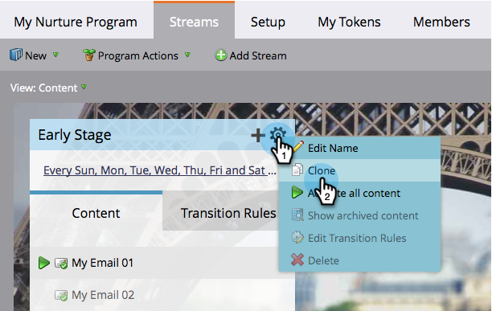

# 스트림 복제 {#clone-a-stream}

서로 다른 주문 및 서로 다른 케이던스 테스트를 포함하여 다양한 이유로 스트림을 복제합니다.

1. 참여 프로그램을 선택하고 **[!UICONTROL Streams]** 탭으로 이동합니다.

   

1. 스트림 톱니바퀴 아이콘을 클릭한 다음 **[!UICONTROL Clone]**&#x200B;을(를) 클릭합니다.

   

   >[!NOTE]
   >
   >참여 프로그램당 최대 25개의 스트림을 보유할 수 있습니다.

   

   >[!CAUTION]
   >
   >Cadence를 제외하고 스트림의 모든 항목이 복제됩니다. 설정하는 것을 잊지 마십시오.
