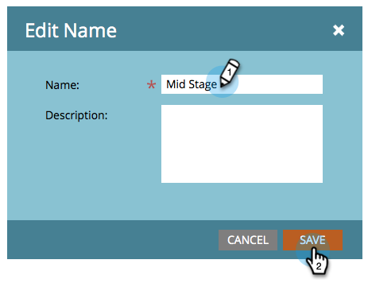

# 스트림 이름 변경 {#rename-a-stream}

구성을 유지하려면 스트림의 이름을 바꿀 수 있습니다.

1. 참여 프로그램을 찾아 선택한 다음 **[!UICONTROL Streams]**&#x200B;을(를) 클릭합니다.

   

1. 현재 스트림 이름을 두 번 클릭합니다.

   

1. 새 스트림 **[!UICONTROL Name]**&#x200B;을(를) 입력하고 **[!UICONTROL Save]**&#x200B;을(를) 클릭합니다.

   
