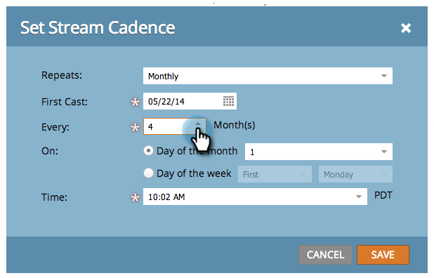
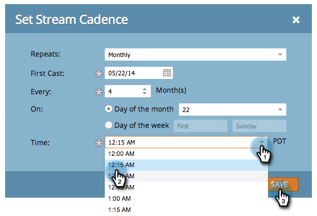

# 스트림 패턴 설정 {#set-stream-cadence}

원하는 간격으로 참여 컨텐츠를 보낼 수 있습니다. 예:한 주에 한 번, 또는 그 달의 세 번째 화요일마다 한 번.

## 카드 설정 {#set-cadence}

1. 마케팅 활동 **으로 이동합니다**.

   

1. 참여 프로그램을 찾아 선택하고 **Streams **탭을 클릭한 다음 스트림 **범위 설정을 클릭합니다**.

   

1. 케이지가 반복될 빈도를 선택합니다. **** 주별** 또는 **월별**&#x200B;중에서 선택할 수 있습니다.

## 주별 {#weekly}

1. [ **주별]을 선택합니다**.

   

   >[!NOTE]
   >
   >**없음 **을 선택하면 스트림이 종료됩니다.

1. 첫 출연자의 날짜를 선택하세요.

   

1. 이제 케이지가 매주 또는 그 이상의 간격으로 일어나도록 할지 선택합니다. 매 2주마다 고르자.

   

1. 요일을 결정하십시오. 이 경우 화요일, 수요일, 목요일로 합시다.

   

   >[!TIP]
   >
   >반복 횟수를 선택하면 케이지가 매일 실행되도록 설정할 수 **있습니다.매주** /**1주** /** ****켜기**:하루 종일

   이제 시간을 선택하십시오. 수신자 [시간대](set-stream-cadence/schedule-engagement-programs-with-recipient-time-zone.md)(예: 현지 시간대에 따라 배달)를 사용하려면 확인란을 선택한 다음 저장을 클릭합니다.
   

   >[!CAUTION]
   >
   >첫 번째 캐스팅에 대해 선택한 날짜에 콘텐트가 표시되므로 선택한 요일과 일치하는지 확인합니다.그렇지 않으면 첫 주에 두 번 밖에 나갈 겁니다

1. 커덴스 위로 마우스를 가져갑니다. 앞으로 몇 일 동안 캐스트가 나오는지 확인할 수 있습니다.

   

   >[!NOTE]
   >
   >이 예에서는 목요일에 이메일이 발송됩니다. 그 다음 주 화요일, 수요일, 그리고 다음 주 목요일에 다시 발송합니다. 그리고 다시 반복하죠.

바로 그거야! 월간 교실을 설정하려면 계속 읽으세요.

## 월별 {#monthly}

1. 반복 횟수를 확인하려면 **Monthly **를 선택합니다.

   

1. 첫 출연자의 날짜를 선택하세요.

   

1. 매월 또는 그 이상의 간격을 유지하려면 선택하십시오.매 4개월마다 고르자.

   

1. 지정한 월의 날짜를 선택합니다. 이 경우 4개월마다 22일을 선택합니다.

   

   >[!TIP]
   >
   >또는 요일을 선택할 수도 있습니다.

1. 시간을 **선택하고** 저장을 **클릭합니다**.

   

1. 커덴스 위로 마우스를 가져갑니다. 앞으로 몇 일 동안 캐스트가 나오는지 확인할 수 있습니다.

   

   >[!CAUTION]
   >
   >나중에 관여 스트림 간격을 수정하려는 경우 첫 번째 캐스팅이 미래 날짜로 설정되어 있는지 확인합니다.

이제 여러분은 스트림 캐더스를 어떻게 설정하는지 알고 있습니다!

>[!NOTE]
>
>**관련 문서**
>
>* [수신자 시간대 이해](../../../../product-docs/email-marketing/email-programs/email-program-actions/scheduling-with-recipient-time-zone/understanding-recipient-time-zone.md)
>* [받는 사람 시간대에서 참여 프로그램 예약](set-stream-cadence/schedule-engagement-programs-with-recipient-time-zone.md)

>

