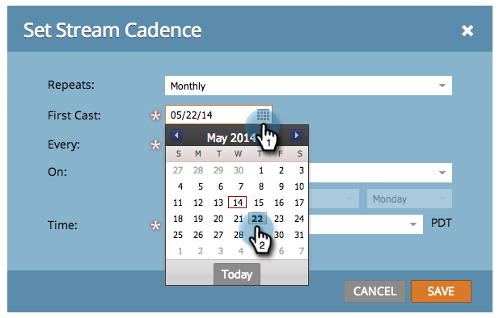

# 스트림 케이던스 설정 {#set-stream-cadence}

원하는 간격으로 참여 콘텐츠를 보낼 수 있습니다. 예를 들어, 일주일에 한 번 또는 그 달의 세 번째 화요일에 한 번씩.

## 케이던스 설정 {#set-cadence}

1. **[!UICONTROL Marketing Activities]**(으)로 이동합니다.

   

1. 참여 프로그램을 찾아 선택하고 **[!UICONTROL Streams]** 탭을 클릭한 다음 **[!UICONTROL Set Stream Cadence]**&#x200B;을(를) 클릭합니다.

   

1. 케이던스를 반복할 빈도를 선택합니다. **[!UICONTROL Weekly]** 또는 **[!UICONTROL Monthly]**&#x200B;을(를) 선택할 수 있습니다.

## 매주 {#weekly}

1. **[!UICONTROL Weekly]**&#x200B;를 선택합니다.

   

   >[!NOTE]
   >
   >**[!UICONTROL None]**&#x200B;을(를) 선택하면 스트림이 종료됩니다.

1. 첫 번째 출연자의 날짜를 선택합니다.

   

1. 이제 케이던스를 매주 또는 간격을 두고 발생시키려면 선택합니다. 2주에 한 번씩 정해 봅시다.

   

1. 요일 을 결정합니다. 이 경우에는 화요일, 수요일, 목요일을 합시다.

   

   >[!TIP]
   >
   >**[!UICONTROL Repeats]:[!UICONTROL Weekly]** / **[!UICONTROL Every]: 1[!UICONTROL Week]** / **[!UICONTROL On]**: 모두 일을 선택하여 매일 실행되도록 케이던스를 설정할 수 있습니다.

   이제 시간을 선택하세요. [받는 사람 시간대](/help/marketo/product-docs/email-marketing/drip-nurturing/engagement-program-streams/set-stream-cadence/schedule-engagement-programs-with-recipient-time-zone.md)을(를) 사용하려면(즉, 현지 시간대에 따라 배달) 확인란을 선택한 다음 **[!UICONTROL Save]**&#x200B;을(를) 클릭합니다.

   

   >[!CAUTION]
   >
   >콘텐츠는 첫 번째 캐스팅에 대해 선택한 날짜에 배포되므로 선택한 요일과 일치하는지 확인하십시오. 그렇지 않으면 첫 주에 두 번 배포됩니다.

1. 케이던스 위로 마우스를 가져갑니다. 앞으로 출연할 출연진들이 며칠이나 빠질지 지켜볼 일이다.

   

   >[!NOTE]
   >
   >이 예에서는 이메일이 목요일에 발송됩니다. 그 다음 주는 건너뛰고 그 다음 주 화요일, 수요일, 목요일에 다시 보냅니다. 그리고 다시 반복됩니다.

됐습니다. 월간 케이던스를 설정하려면 계속 읽으십시오.

## 매월 {#monthly}

1. **[!UICONTROL Monthly]**&#x200B;을(를) 선택하여 반복 빈도를 확인합니다.

   

1. 첫 번째 출연자의 날짜를 선택합니다.

   

1. 매월 또는 그 이상의 간격을 두려면 선택하십시오. 4개월마다 고르자.

   

1. 매월 22일, 이 경우 지정한 달의 날짜를 선택합니다.

   

   >[!TIP]
   >
   >또는 요일을 선택할 수 있습니다.

1. **[!UICONTROL Time]**&#x200B;을(를) 선택하고 **[!UICONTROL Save]**&#x200B;을(를) 클릭합니다.

   

1. 케이던스 위로 마우스를 가져갑니다. 앞으로 출연할 출연진들이 며칠이나 빠질지 지켜볼 일이다.

   

   >[!CAUTION]
   >
   >나중에 참여 스트림 케이던스를 수정하기로 결정한 경우 첫 번째 캐스트가 미래 날짜로 설정되었는지 확인하십시오.

이제 스트림 케이던스를 설정하는 방법을 알았습니다!

>[!MORELIKETHIS]
>
>* [받는 사람 시간대 이해](/help/marketo/product-docs/email-marketing/email-programs/email-program-actions/scheduling-with-recipient-time-zone/understanding-recipient-time-zone.md)
>* [받는 사람 시간대로 참여 프로그램 예약](/help/marketo/product-docs/email-marketing/drip-nurturing/engagement-program-streams/set-stream-cadence/schedule-engagement-programs-with-recipient-time-zone.md)
