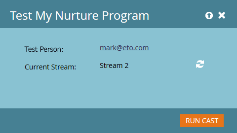

# 참여 스트림 테스트 {#test-an-engagement-stream}

모든 콘텐츠를 스트림에 추가했으면 한 번에 하나씩 테스트할 수 있습니다.

>[!NOTE]
>
>**FYI**
>
>Marketing은 이제 모든 구독 간의 언어를 표준화하므로 구독에 리드/리드 및 docs.markto.com에 있는 사람/사람을 볼 수 있습니다. 이 용어는 같은 것을 의미한다.아티클 지침에는 영향을 주지 않습니다. 다른 변화도 있습니다 [자세한](http://docs.marketo.com/display/DOCS/Updates+to+Marketo+Terminology)내용

1. 마케팅 활동 **으로 이동합니다**.

   

1. 참여 프로그램을 선택합니다.

   

1. 프로그램 작업**을 클릭하고 스트림 **테스트를 선택합니다**.

   

1. **Test Person **드롭다운에서 사용자를 선택합니다. 컨텐츠는 실제로 사라진다는 점을 잊지 마십시오.

   

   >[!CAUTION]
   >
   >테스트 사용자가 고유하며 데이터베이스에 중복되지 않았는지 확인하십시오.

   >[!TIP]
   >
   >원하는 테스트 사용자가 없는 경우 [사용자 **만들기** ] 옵션을 사용하여 즉시 사용자를 만듭니다.

   초기 스트림을 클릭하고 테스트할 스트림을 선택하고 캐스트 실행을 클릭합니다.
   

1. 이전에 설정한 [전환 규칙을](transition-people-between-engagement-streams.md) 거치고 나면 새로 고침 아이콘을 클릭합니다.

   

1. 테스트 성공 여부를 나타내는 새 스트림이 나타납니다.

   

   잘했어!

   >[!NOTE]
   >
   >**Run Cast **를 다시 클릭하지 않으면 다른 컨텐츠는 전송되지 않습니다.

