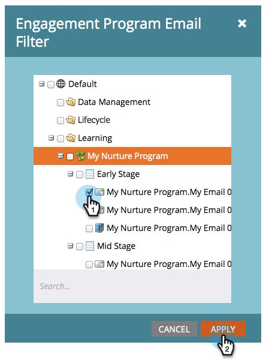

# 참여 스트림 성과 보고서 {#engagement-stream-performance-report}

참여 콘텐츠의 성과가 어떤지 알고 싶으신가요? 참여 스트림 성능 보고서를 사용해 보십시오.

## 보고서 만들기 {#create-the-report}

1. 참여 프로그램을 찾아 선택한 다음 아래에서 **신규** 클릭 **새 로컬 자산**.

   

1. 선택 **보고서**.

   

   >[!TIP]
   >
   >프로그램 아래에서 보고서를 만들면 프로그램 콘텐츠로 자동 제한됩니다.

   참여 스트림 성과 를 보고서 유형으로 선택합니다.
   

1. 보고서 이름을 지정하고 **만들기**.

   

   좋아! 이제 설정을 확인해 보겠습니다.

## 설정 편집 {#edit-settings}

1. 보고서를 찾아 선택합니다.

   

1. 아래 **설정** 탭을 클릭하고 **참여 프로그램 이메일** 필터.

   

1. 보고할 이메일을 선택하고 **적용**.

   

## 보고서 실행 {#run-report}

1. 보고서를 실행하려면 **보고서** 탭.

   

   >[!TIP]
   >
   >그림은 아니지만 참여 점수 는 이 보고서의 열입니다. 다음을 참조하십시오 [참여 점수 이해](/help/marketo/product-docs/email-marketing/drip-nurturing/reports-and-notifications/understanding-the-engagement-score.md) 자세한 내용.

   잘했어! 보고서는 참여 프로그램별로 그룹화됩니다.
