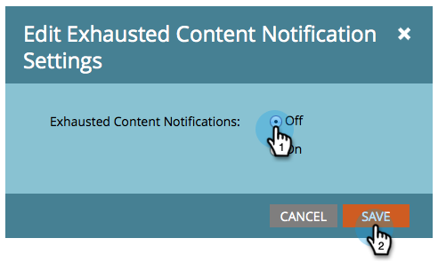

# 소진된 콘텐츠 알림 비활성화 및 활성화 {#disable-and-enable-exhausted-content-notifications}

사람들이 스트림의 모든 콘텐츠를 소진하면 Marketo에서 알림을 전송할 수 있습니다. 필요에 따라 알림을 비활성화/활성화할 수 있습니다.

1. **[!UICONTROL Marketing Activities]** 으로 이동합니다.

   

1. 참여 프로그램을 선택하고 **[!UICONTROL Setup]** 탭을 클릭합니다.

   

1. **[!UICONTROL Exhausted Content Notifications]**&#x200B;을(를) 두 번 클릭합니다.

   

1. **[!UICONTROL Off]**(또는 **[!UICONTROL On]**)을(를) 선택하고 **[!UICONTROL Save]**&#x200B;을(를) 클릭합니다.

   

   알림을 활성화하면 스트림 자체에 표시되는 항목과 이메일 알림을 받을 수 있습니다.
