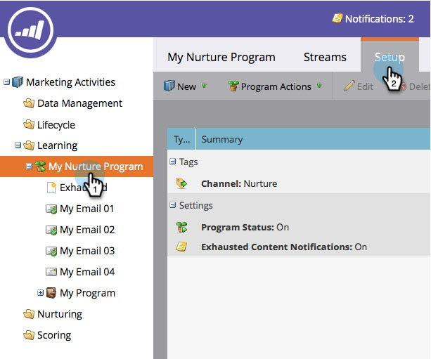

# 고갈된 컨텐츠 알림 비활성화 및 활성화 {#disable-and-enable-exhausted-content-notifications}

사람들이 스트림의 모든 컨텐츠를 배포함으로써 Marketing에서 알림을 보낼 수 있습니다. 필요에 따라 알림을 비활성화하거나 활성화할 수 있습니다. 방법

1. **마케팅 활동**&#x200B;으로 이동합니다.

   

1. 참여 프로그램을 선택하고 **설정** 탭을 클릭합니다.

   

1. **고갈된 컨텐트 알림**&#x200B;을 두 번 클릭합니다.

   

1. **Off **(또는 **On**)을 선택하고 **저장**&#x200B;을 클릭합니다.

   

   수퍼! 알림을 활성화하면 스트림 자체에 어떤 내용이 표시되고 이메일 알림이 수신됩니다.

