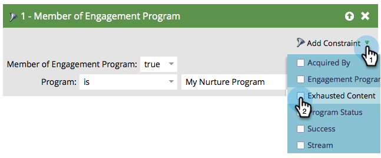

# 콘텐츠가 모두 소진된 사람 {#people-who-have-exhausted-content}

스트림의 모든 컨텐츠를 수신하면 모든 가능성이 소진되고 더 많은 컨텐츠가 추가될 때까지 유휴 상태로 대기합니다. 기진맥진한 사람을 여러 가지 방법으로 찾을 수 있다.

## 참여 프로그램 구성원 필터 {#member-of-engagement-program-filter}

1. 새 스마트 목록을 만든 다음 **참여 프로그램 구성원** 필터.

   

1. 지친 사람을 찾을 참여 프로그램을 찾아 선택합니다.

   

1. 아래 **제한 추가**, 선택 **소진된 컨텐츠**.

   

1. 설정 **소진된 컨텐츠** to **true**.

   

   이 스마트 목록을 실행하여 스트림의 모든 컨텐츠를 소진한 사용자 목록을 확인하면 됩니다.

## 멤버 탭 {#members-tab}

1. 이동 **마케팅 활동**.

   

1. 참여 프로그램을 선택하고 **멤버** 탭.

   

1. 다음 열에 주목하십시오. **소진된 컨텐츠**.

   

   이는 모든 컨텐츠를 소진한 사용자와 그렇지 않은 사용자를 보여줍니다.

## 스트림 {#stream}

1. 스트림 자체의 스트림 탭에서 컨텐츠를 소진한 총 사용자도 볼 수 있습니다.

   

   >[!NOTE]
   >
   >이 번호는 각 캐스트 직후에 업데이트됩니다.
