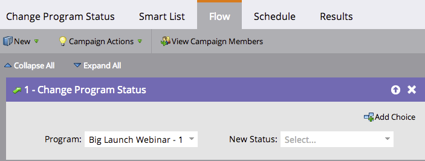

# 참여 프로그램에서 구성원 제거 {#remove-a-member-from-an-engagement-program}

이런! 그 사람들은 어떻게 거기에 들어갔죠? 프로그램 상태 **변경 흐름 단계를 사용하여 참여 프로그램에서 구성원을 제거할** 수 있습니다.

>[!NOTE]
>
>**FYI**
>
>Marketing은 이제 모든 구독 간의 언어를 표준화하므로 구독에 리드/리드 및 docs.markto.com에 있는 사람/사람을 볼 수 있습니다. 이 용어는 같은 것을 의미한다.아티클 지침에는 영향을 주지 않습니다. 다른 변화도 있습니다 [자세한](http://docs.marketo.com/display/DOCS/Updates+to+Marketo+Terminology)내용

>[!TIP]
>
>다른 사람을 위해 컨텐츠를 일시 중지하기 위해 이것을 사용하지 마십시오. 그러면 분석에서 모든 기여도가 없어집니다.  참여 프로그램에서 사용자를 [일시 정지하는 방법에 대한 자세한 내용을 살펴보십시오](pause-people-in-an-engagement-program.md).

## 흐름 단계 {#flow-step}

1. 프로그램 상태 **변경** 흐름 단계에서 드래그합니다.

   

   프로그램 안 함 상태 **를 선택합니다**.

   

   짜증 스마트 목록에 정의된 모든 [멤버가](../../../../product-docs/core-marketo-concepts/smart-lists-and-static-lists/creating-a-smart-list/create-a-smart-list.md) 더 이상 이 참여 프로그램에 포함되지 않습니다.

## 사용자 일시 중지  {#pause-people}

때때로 참여 프로그램에서 사람들을 일시 중지하고 제거하지 않으려는 경우가 있습니다. 이 작업은 **변경 참여 프로그램 케이던스로 수행됩니다**.

>[!NOTE]
>
>**관련 문서**
>
>* [참여 프로그램에서 사람 일시 중지](pause-people-in-an-engagement-program.md)

