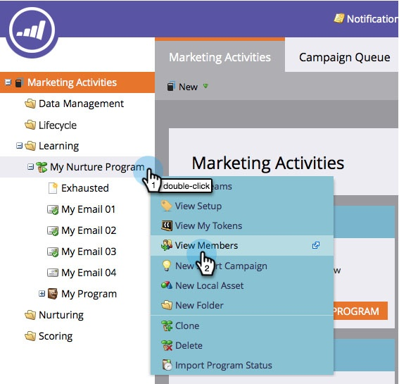

# 참여 프로그램 멤버 보기 {#see-members-of-an-engagement-program}

참여 프로그램의 구성원을 빠르게 볼 수 있습니다. 방법은 다음과 같습니다.

1. 참여 프로그램에서 마우스 오른쪽 단추를 클릭하고 **[!UICONTROL View Members]**&#x200B;을(를) 선택합니다.

   

   >[!NOTE]
   >
   >[모두 사용된 콘텐츠](/help/marketo/product-docs/email-marketing/drip-nurturing/creating-an-engagement-program/understanding-engagement-programs.md) 열 값은 모든 캐스트 후에 업데이트됩니다.

1. 이제 프로그램의 모든 구성원을 볼 수 있습니다.

   
