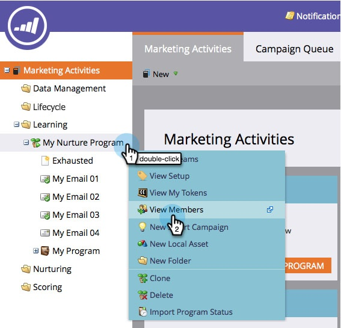

# 참여 프로그램 멤버 참조 {#see-members-of-an-engagement-program}

참여 프로그램 구성원을 빠르게 볼 수 있습니다. 방법

1. 참여 프로그램에서 마우스 오른쪽 단추를 클릭하고 구성원 **보기를 선택합니다.**

   

   >[!NOTE]
   >
   >모든 [캐스트 후에](../../../../product-docs/email-marketing/drip-nurturing/creating-an-engagement-program/understanding-engagement-programs.md) Used Content 열 값이 업데이트됩니다.

1. 이제 프로그램의 모든 구성원을 볼 수 있습니다.

   

