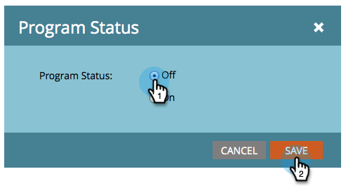

# 참여 프로그램 설정 및 해제 {#turn-an-engagement-program-on-and-off}

스위치 화면으로 참여 프로그램을 끌 수 있습니다. 이렇게 하면 콘텐츠가 전송되지 않습니다. 방법은 다음과 같습니다.

1. 이동 **마케팅 활동**.

   

1. 참여 프로그램을 선택하고 을(를) 클릭합니다. **설정**.

   >[!NOTE]
   >
   >참여 프로그램은 가입 한도를 초과하지 않는 한 기본적으로 켜져 있습니다.

   

1. 두 번 클릭 **프로그램 상태**.

   

1. 선택 **해제** 을(를) 클릭합니다. **저장**.

   

됐다! 같은 단계를 사용하여 다시 설정할 수 있습니다.
