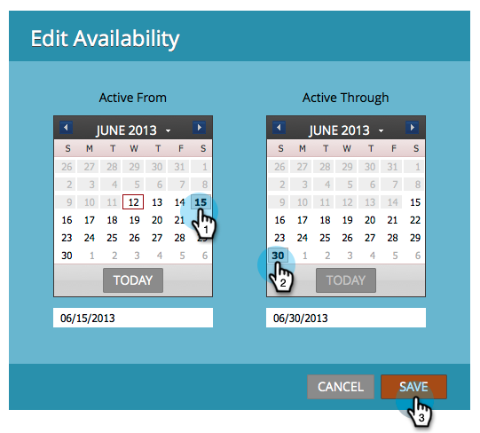

# 스트림 컨텐츠의 가용성 편집 {#edit-availability-of-stream-content}

컨텐츠가 스트림에서 활성화되도록 시간을 설정할 수 있습니다. 방법

1. 참여 프로그램을 선택하고 스트림 **탭으로** 이동합니다.

   

1. 예약할 컨텐츠 부분에 대한 톱니바퀴 아이콘을 클릭한 다음 가용성 **편집을 선택합니다**.

   

1. 활성 **시작** 날짜를 선택한 다음 **활성 - **날짜를 선택하고 **저장을 클릭합니다**.

   

   >[!TIP]
   >
   >컨텐츠를 **영구적으로 사용할 수 있도록 하려면** 활성을 비워 둘 수 있습니다.

   완벽해! 예약된 컨텐츠 옆에 시계 아이콘이 표시됩니다. 설정한 일정에 따라 활성화되고 비활성화됩니다.   

