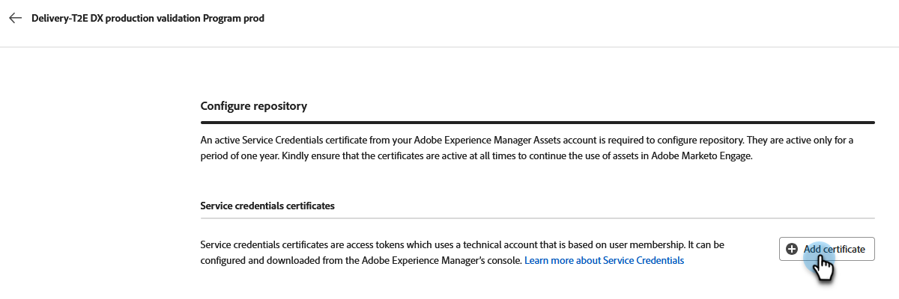
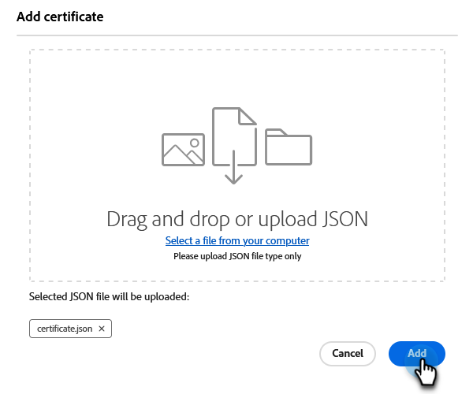

# Experience Manager 에셋 작업 {#work-with-experience-manager-assets}

_Adobe Experience Manager Assets as a Cloud Service_ 계정을 Adobe Marketo Engage 인스턴스에 연결하면 Marketo Engage 이메일 Designer에서 AEM 자산 저장소를 활용할 수 있습니다.

>[!NOTE]
>
>현재 _Adobe Experience Manager Assets_&#x200B;의 이미지 자산만 Marketo Engage에서 지원됩니다. 에셋에 대한 변경은 Adobe Experience Manager Assets 중앙 저장소에서 수행해야 합니다. [자세히 알아보기](https://experienceleague.adobe.com/ko/docs/experience-manager-cloud-service/content/assets/manage/manage-digital-assets){target="_blank"}

## AEM 클라우드 서비스에 대한 링크 {#link-to-your-aem-cloud-services}

이 기능을 사용하려면 먼저 AEM Cloud Services를 Adobe Marketo Engage에 연결해야 합니다.

+++AEM Cloud Services 및 Marketo Engage 연결

>[!NOTE]
>
>**관리자 권한 필요**

1. Marketo Engage에서 **관리자** 영역으로 이동하여 왼쪽 탐색 트리에서 **Adobe Experience Manager**&#x200B;을(를) 선택하십시오.

   {width="800" zoomable="yes"}

1. _Adobe Experience Manager 클라우드 서비스_ 옆에 있는 **편집**&#x200B;을 클릭합니다.

   {width="400" zoomable="yes"}

1. 저장소를 하나 이상 선택합니다.

   {width="800" zoomable="yes"}

   >[!NOTE]
   >
   >* Marketo Engage 구독과 동일한 IMS 조직에 연결된 저장소만 나열됩니다.
   >
   >* Marketo Engage은 게재 계층의 저장소만 지원합니다. 작성자 계층을 사용하고 이 계층을 변환하려면 [Adobe Experience Manager 지원](https://experienceleague.adobe.com/ko/docs/experience-manager-cloud-manager/content/overview/help-resources)에 문의하십시오.

1. 저장소를 구성하려면 [서비스 자격 증명 인증서](https://experienceleague.adobe.com/ko/docs/experience-manager-learn/getting-started-with-aem-headless/authentication/service-credentials)를 추가해야 합니다. **+ 인증서 추가** 단추를 클릭합니다.

   {width="800" zoomable="yes"}

1. 인증서를 드래그 앤 드롭하거나(JSON 파일만) 컴퓨터에서 선택합니다. 완료되면 **추가**&#x200B;를 클릭하세요.

   {width="600" zoomable="yes"}

1. 구성된 저장소는 상태 및 만료와 함께 아래에 표시됩니다. 인증서를 보려면 줄임표 단추(**...**)를 클릭하십시오. 그렇지 않으면, 넌 끝이야.

   {width="700" zoomable="yes"}

이제 해당 저장소의 디지털 에셋 관리 라이브러리에 있는 모든 이미지는 Marketo Engage 이메일 Designer에서 액세스할 수 있습니다.

+++

## AEM 자산 작업 {#working-with-aem-assets}

이러한 디지털 에셋을 사용하는 경우 _Assets as a Cloud Service_&#x200B;의 최신 변경 내용이 연결된 참조를 통해 실시간 이메일 캠페인에 자동으로 전파됩니다. _Adobe Experience Manager Assets as a Cloud Service_&#x200B;에서 이미지가 삭제되면 이메일에 손상된 참조가 함께 표시됩니다. 현재 Marketo Engage에서 사용 중인 에셋이 수정되거나 삭제되면 이메일 작성자에게 이미지 변경 사항에 대한 알림이 표시됩니다. 에셋에 대한 모든 변경 작업은 Adobe Experience Manager Assets 중앙 저장소에서 수행해야 합니다.

### AEM Assets을 이미지 소스로 사용 {#use-aem-assets-as-the-image-source}

환경에 하나 이상의 에셋 저장소 연결이 있는 경우 이메일, 이메일 템플릿 또는 시각적 조각에 대한 세부 사항을 만들거나 볼 때 AEM Assets을 에셋의 소스로 지정할 수 있습니다.

* 새 콘텐츠를 만들 때 대화 상자에서 `AEM Assets`을(를) **[!UICONTROL Image Source]** 항목으로 선택하십시오.

{width="400" zoomable="yes"}

* 기존 콘텐츠 리소스를 열 때 오른쪽의 _[!UICONTROL Body]_&#x200B;섹션에서 `AEM Assets`을(를) 선택합니다.

{width="700" zoomable="yes"}

### 작성을 위해 에셋에 액세스 {#access-assets-for-authoring}

>[!IMPORTANT]
>
>관리자는 자산에 액세스해야 하는 사용자를 Assets 소비자 사용자 및/또는 Assets 사용자 제품 프로필에 추가해야 합니다. [자세히 알아보기](https://experienceleague.adobe.com/ko/docs/experience-manager-cloud-service/content/security/ims-support#managing-products-and-user-access-in-admin-console)

시각적 컨텐츠 편집기에서 왼쪽 사이드바의 _Experience Manager 자산 선택기_ 아이콘을 클릭합니다. 이렇게 하면 도구 패널이 선택한 저장소에서 사용 가능한 에셋 목록으로 변경됩니다.

{width="700" zoomable="yes"}

연결된 AEM 저장소가 두 개 이상 있는 경우 **[!UICONTROL Manage as]** 단추를 클릭하여 사용할 저장소를 선택합니다.

{width="700" zoomable="yes"}

원하는 저장소를 선택합니다.

{width="500" zoomable="yes"}

이미지 에셋을 시각적 캔버스에 추가하는 방법에는 여러 가지가 있습니다.

* 왼쪽 탐색에서 이미지 썸네일을 끌어서 놓습니다.

{width="700" zoomable="yes"}

* 캔버스에 이미지 구성 요소를 추가하고 **[!UICONTROL Browse]**&#x200B;을(를) 클릭하여 _[!UICONTROL Select Assets]_&#x200B;대화 상자를 엽니다.

  대화 상자에서 선택한 저장소에서 이미지를 선택할 수 있습니다.

  필요한 에셋을 찾는 데 도움이 되는 여러 가지 도구가 있습니다.

{width="700" zoomable="yes"}

* 오른쪽 상단에서 **[!UICONTROL Repository]**&#x200B;을(를) 변경합니다.

* 다른 브라우저 탭에서 Assets 저장소를 열고 AEM Assets 관리 도구를 사용하려면 오른쪽 상단의 **[!UICONTROL Manage assets]**&#x200B;을(를) 클릭합니다.

* 표시를 **[!UICONTROL List View]**, **[!UICONTROL Grid View]**, **[!UICONTROL Gallery View]** 또는 **[!UICONTROL Waterfall View]**(으)로 변경하려면 오른쪽 상단의 _보기 유형_ 선택기를 클릭하십시오.

* 오름차순과 내림차순 사이의 정렬 순서를 변경하려면 _정렬 순서_ 아이콘을 클릭하십시오.

* 정렬 기준을 **[!UICONTROL Name]**, **[!UICONTROL Size]** 또는 **[!UICONTROL Modified]**(으)로 변경하려면 **[!UICONTROL Sort by]** 메뉴 화살표를 클릭하십시오.

* 조건에 따라 표시된 항목을 필터링하려면 왼쪽 상단의 _필터_ 아이콘을 클릭하십시오.

* 표시된 항목을 자산 이름과 일치하도록 필터링하려면 검색 필드에 텍스트를 입력합니다.

{width="700" zoomable="yes"}
