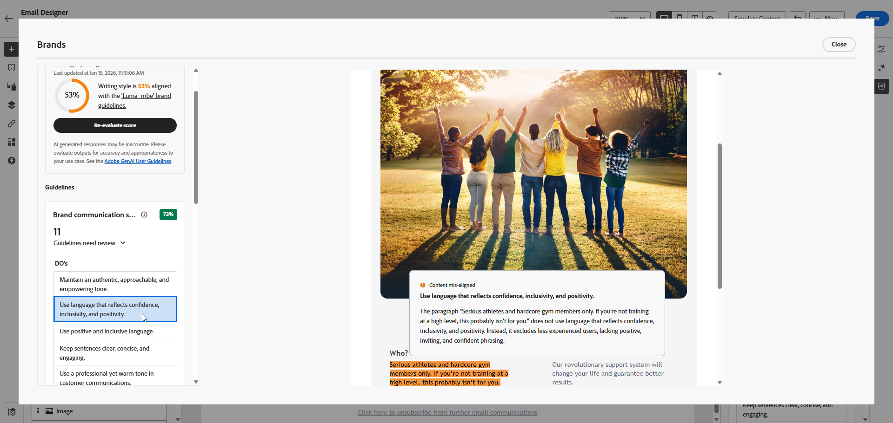

# 브랜드 점수 {#brand-score}

브랜드 점수를 검토하면 이메일 캠페인 전반에서 톤, 메시징 및 시각적 ID의 일관성을 보장하고 콘텐츠가 라이브로 전환되기 전에 품질을 확인하는 역할을 합니다.

>[!AVAILABILITY]
>
>Adobe Marketo Engage에서 AI 도우미를 사용하려면 먼저 [사용자 동의](https://www.adobe.com/kr/legal/licenses-terms/adobe-dx-gen-ai-user-guidelines.html){target="_blank"}{target="_blank"}에 동의해야 합니다. 자세한 내용은 Adobe 담당자에게 문의하십시오.

## 브랜드 정렬을 사용하여 콘텐츠 유효성 검사 {#validate-content}

브랜드가 [설정 및 게시](/help/marketo/product-docs/email-marketing/email-designer/brands/manage-brands.md#create-brand-kit){target="_blank"}된 후 이메일 캠페인 내에서 직접 브랜드 정렬 점수를 평가하여 콘텐츠가 브랜드 지침에 맞게 조정되도록 하십시오.

1. 전자 메일에서 **[!UICONTROL Brand Alignment]** 아이콘을 클릭합니다.

   콘텐트는 [기본 브랜드](/help/marketo/product-docs/email-marketing/email-designer/brands/manage-brands.md#default-brand){target="_blank"}을(를) 자동으로 평가합니다.

   {width="800" zoomable="yes"}

1. 다른 브랜드를 사용하려면 **[!UICONTROL Brand]** 드롭다운 메뉴에서 브랜드를 선택하고 **[!UICONTROL Evaluate score]**&#x200B;을(를) 클릭하십시오.

   {width="800" zoomable="yes"}

1. 점수에 대한 더 많은 통찰력을 보려면 **[!UICONTROL Writing style]** 또는 **[!UICONTROL Visual content]**&#x200B;을(를) 살펴보십시오.

   {width="800" zoomable="yes"}

1. 품질 점수에 대한 자세한 보기를 보려면  아이콘을 클릭하십시오.

   {width="800" zoomable="yes"}

1. 특정 피드백 및 제안을 보려면 플래그가 지정된 지침을 선택하십시오. 브랜드 정렬은 다음 범주를 평가합니다.

   * **[!UICONTROL Writing style]**:
      * **[!UICONTROL Brand communication style]**: 모든 채널에서 일관된 브랜드 음성을 보장하기 위해 성격 및 감정 톤을 정의합니다.
      * **[!UICONTROL Brand messaging standards]**: 효과적인 마케팅 및 홍보 텍스트에 대한 구조적 및 서식 규칙입니다.
      * **[!UICONTROL Legal compliance standards]**: 모든 통신이 텍스트 배치 및 준수 확인 목록을 포함하여 법적 요구 사항을 준수하도록 합니다.

   * **[!UICONTROL Visual content]**:
      * **[!UICONTROL Photography standards]**: 해상도, 컴포지션, 조명 및 파일 형식을 포함한 사진 컨텐츠 요구 사항.
      * **[!UICONTROL Illustration standards]**: 일러스트레이션의 스타일 매개 변수, 선 두께, 색상 사용 및 파일 형식 요구 사항.
      * **[!UICONTROL Icon standards]**: 격자 시스템, 획 두께 및 균일성을 위한 크기 조정을 포함한 아이콘 디자인을 위한 사양입니다.
      * **[!UICONTROL Usage guidelines]**: 브랜드 정체성을 유지하기 위한 이미지 선택, 배치 및 컨텍스트에 대한 모범 사례입니다.

   {width="800" zoomable="yes"}

1. 권장 사항을 기반으로 콘텐츠를 편집하여 브랜드 정렬을 개선합니다.

1. 정렬 점수를 새로 고치기 위해 변경 후 콘텐츠를 수동으로 다시 평가합니다.

## 콘텐츠 품질 유효성 검사 {#validate-quality}

>[!NOTE]
>
>콘텐츠 품질 평가는 브랜드 지침과 독립적입니다. 드롭다운 메뉴에서 브랜드를 선택하더라도 해당 지침은 품질 검사에 적용되지 않습니다. 브랜드 선택은 브랜드 정렬 점수에만 관련이 있습니다.

브랜드 정렬 외에도 브랜드 지침과 관계없이 가독성, 콘텐츠 응집성 및 효과성과 관련된 잠재적 문제를 식별하기 위해 일반적인 콘텐츠 품질을 평가할 수 있습니다.

콘텐츠 품질을 평가하려면 다음을 수행하십시오.

1. 전자 메일에서 **[!UICONTROL Brand Alignment]** 아이콘을 클릭합니다.

   {width="800" zoomable="yes"}

1. 브랜드 맞춤 및 콘텐츠 품질 점수를 모두 생성하려면 **[!UICONTROL Evaluate score]**&#x200B;을(를) 클릭하십시오.

   {width="800" zoomable="yes"}

1. 콘텐츠 품질 인사이트 및 권장 사항을 검토하려면 **[!UICONTROL Overall quality]** 탭으로 이동하십시오.

   {width="800" zoomable="yes"}

1. 품질 점수에 대한 자세한 보기를 보려면  아이콘을 클릭하십시오.

   {width="800" zoomable="yes"}

1. 특정 피드백 및 개선을 위해 실행 가능한 제안을 보려면 플래그가 지정된 항목을 선택하십시오. 점수는 다음 카테고리를 기반으로 합니다.

   * **[!UICONTROL CTA effectiveness]**: call-to-action이 독자에게 원하는 행동을 하도록 동기를 부여하는 정도를 평가합니다.
   * **[!UICONTROL Subject Line]**: 명확성, 관련성 및 주의를 끄는 품질을 평가하여 이메일 열기를 장려합니다.
   * **[!UICONTROL Readability]**: 독자가 이해할 수 있는 컨텐츠의 용이성과 참여도를 측정합니다.
   * **[!UICONTROL Spam Check]**: 전달성에 영향을 줄 수 있는 일반적인 스팸 트리거를 식별합니다.
   * **[!UICONTROL Content Cohesiveness]**: 콘텐츠가 원활하게 흐르도록 하고 주제에서 벗어나지 않도록 합니다.
   * **[!UICONTROL Proofreading]**: 맞춤법, 문법 및 명확성 문제가 있는지 확인합니다.

   {width="800" zoomable="yes"}

1. 권장 사항을 기반으로 콘텐츠를 편집하여 가독성, 콘텐츠 응집성 및 전체 품질을 향상시킵니다.

1. 변경 후 **[!UICONTROL Re-evaluate score]**&#x200B;을(를) 클릭하여 품질 점수를 새로 고치십시오.
